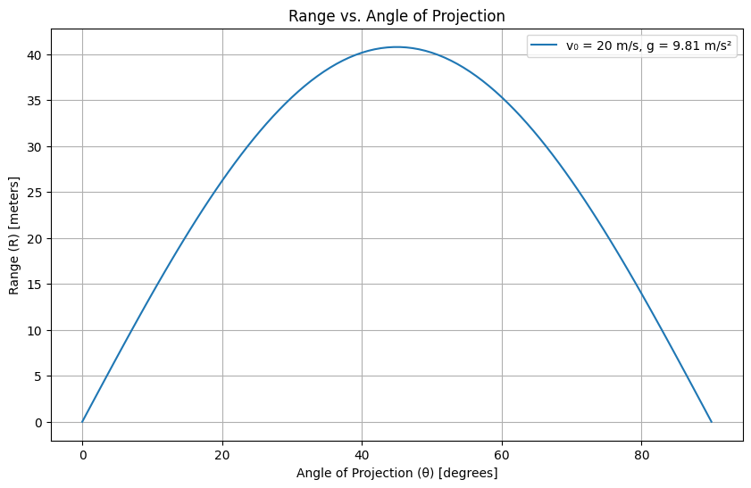

Here’s the corrected version with proper LaTeX rendering for mathematical equations and a Python code block for clarity:

---

### **Mechanics: Investigating the Range as a Function of the Angle of Projection**  

#### **1. Theoretical Foundation**  
Projectile motion is governed by Newton's second law of motion, where the only force acting on the projectile (neglecting air resistance) is gravity. The key assumptions are:  
- Constant gravitational acceleration (\( \vec{g} \)) acting downward.  
- No air resistance or other external forces.  
- Flat, uniform terrain (unless otherwise specified).  

The equations of motion are derived by solving the differential equations:  
\[
\frac{d^2 x}{dt^2} = 0, \quad \frac{d^2 y}{dt^2} = -g
\]  
Integrating with initial conditions:  
- Initial velocity \( v_0 \) at angle \( \theta \).  
- Initial position \( (x_0, y_0) = (0, 0) \) (unless launched from a height).  

The velocity components are:  
\[
v_x(t) = v_0 \cos \theta, \quad v_y(t) = v_0 \sin \theta - gt
\]  
The position as a function of time is:  
\[
x(t) = v_0 \cos \theta \cdot t  
\]  
\[
y(t) = v_0 \sin \theta \cdot t - \frac{1}{2} g t^2  
\]  

The **time of flight** (\( T \)) is found by setting \( y(T) = 0 \):  
\[
T = \frac{2 v_0 \sin \theta}{g}
\]  
The **range** (\( R \)) is the horizontal distance traveled in time \( T \):  
\[
R = v_0 \cos \theta \cdot T = \frac{v_0^2 \sin 2\theta}{g}
\]  

#### **2. Analysis of the Range**  
The range equation \( R = \frac{v_0^2 \sin 2\theta}{g} \) shows:  
- **Maximum range** occurs at \( \theta = 45^\circ \) (since \( \sin 90^\circ = 1 \)).  
- For a fixed \( v_0 \), range depends on \( \sin 2\theta \), meaning complementary angles (e.g., \( 30^\circ \) and \( 60^\circ \)) yield the same range.  
- Increasing \( v_0 \) increases range quadratically.  
- On a planet with lower \( g \), the range increases.  

If the projectile is launched from a height \( h \), the range equation modifies to:  
\[
R = \frac{v_0 \cos \theta}{g} \left( v_0 \sin \theta + \sqrt{v_0^2 \sin^2 \theta + 2gh} \right)
\]  

#### **3. Practical Applications**  
- **Sports:** Calculating the optimal angle for a soccer ball or javelin throw.  
- **Military:** Ballistics trajectory calculations.  
- **Engineering:** Designing water fountains or projectile-based systems.  
- **Space Exploration:** Modeling low-gravity projectile motion (e.g., on the Moon).  

#### **4. Implementation (Python Simulation)**  
```python
import numpy as np
import matplotlib.pyplot as plt

def calculate_range(v0, theta, g=9.81, h0=0):
    theta_rad = np.radians(theta)
    if h0 == 0:
        return (v0**2 * np.sin(2 * theta_rad)) / g
    else:
        return (v0 * np.cos(theta_rad) / g) * (v0 * np.sin(theta_rad) + np.sqrt((v0 * np.sin(theta_rad))**2 + 2 * g * h0))

v0 = 20  # Initial velocity (m/s)
g = 9.81 # Gravity (m/s²)
angles = np.linspace(0, 90, 100)
ranges = [calculate_range(v0, angle) for angle in angles]

plt.figure(figsize=(10, 6))
plt.plot(angles, ranges, label=f"v₀ = {v0} m/s, g = {g} m/s²")
plt.xlabel("Angle of Projection (θ) [degrees]")
plt.ylabel("Range (R) [meters]")
plt.title("Range vs. Angle of Projection")
plt.legend()
plt.grid()
plt.show()
```

#### **Deliverables Summary**  
- **Mathematical Derivation:** Range equation from Newton's laws.  
- **Numerical Simulation:** Python code to visualize \( R(\theta) \).  
- **Graphs:** Range vs. angle for different \( v_0 \) and \( g \).  
- **Limitations:** Discusses absence of air resistance, non-flat terrain, and variable \( g \).  

#### **Further Extensions**  
- Add air resistance (drag force \( \propto v^2 \)).  
- Study projectile motion on an inclined plane.  
- Simulate 3D projectile trajectories.  

---

### **Notes on Display Issues**  
If LaTeX equations or code blocks do not render properly:  
1. **For Markdown/Notebooks:**  
   - Use a LaTeX-enabled environment (e.g., Jupyter Notebook, R Markdown).  
   - Ensure Python code is in a ` ```python ` block.  
2. **For Plain Text:**  
   - Replace LaTeX with Unicode (e.g., `sin²θ` for \( \sin^2 \theta \)).  
   - Indent code blocks manually.  

Let me know if you need further adjustments!