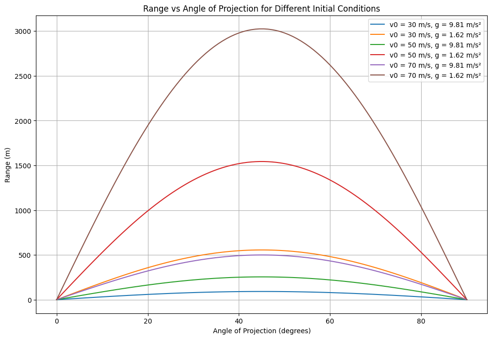

# Task 1: Theoretical Foundation

## 1.1 Equations of Motion for Projectile Motion

The governing equations of motion for a projectile are derived from the basic principles of physics: *Newton's Laws of Motion* and the *equations of constant acceleration*. We will assume there is no air resistance in this idealized scenario.

### Horizontal Motion:

$$
x(t) = v_0 \cdot \cos(\theta) \cdot t
$$

where:
- $x(t)$ is the horizontal position at time $t$,
- $v_0$ is the initial velocity,
- $\theta$ is the angle of projection,
- $t$ is the time.

### Vertical Motion:

$$
y(t) = v_0 \cdot \sin(\theta) \cdot t - \frac{1}{2} g t^2
$$

where:
- $y(t)$ is the vertical position at time $t$,
- $g$ is the acceleration due to gravity ($9.81 \, \text{m/s}^2$).

These two equations describe the horizontal and vertical positions of the projectile at any given time $t$.

---

## 1.2 Time of Flight

The time of flight is the total time the projectile remains in the air before it hits the ground. To find this, we set the vertical position equal to zero at the time of impact:

$$
y(t_f) = 0
$$

Substitute the vertical motion equation:

$$
v_0 \sin(\theta) \cdot t_f - \frac{1}{2} g t_f^2 = 0
$$

Factoring out $t_f$:

$$
t_f \left( v_0 \sin(\theta) - \frac{1}{2} g t_f \right) = 0
$$

Solving for $t_f$ (ignoring the trivial solution $t_f = 0$):

$$
t_f = \frac{2 v_0 \sin(\theta)}{g}
$$

Thus, the time of flight depends on the initial velocity $v_0$ and the angle of projection $\theta$.

---

## 1.3 Range of the Projectile

The range $R$ is the horizontal distance the projectile travels before hitting the ground. It is given by the horizontal motion equation at the time of flight $t_f$:

$$
R = x(t_f) = v_0 \cdot \cos(\theta) \cdot t_f
$$

Substitute the time of flight $t_f = \frac{2 v_0 \sin(\theta)}{g}$ into the equation for range:

$$
R = v_0 \cdot \cos(\theta) \cdot \frac{2 v_0 \sin(\theta)}{g}
$$

Simplifying:

$$
R = \frac{v_0^2 \sin(2\theta)}{g}
$$

This is the formula for the range of a projectile.

---

## 1.4 Family of Solutions Based on Initial Conditions

The range $R$ depends on two variables: the initial velocity $v_0$ and the angle of projection $\theta$.

- *Effect of Initial Velocity $v_0$*: 
  - A higher initial velocity increases the range.
  
- *Effect of Angle of Projection $\theta$*:
  - The range $R$ is a function of $\sin(2\theta)$. Therefore, the range will be maximized when $\theta = 45^\circ$, since $\sin(90^\circ) = 1$.

By varying the initial velocity or launch angle, we obtain a family of solutions describing the projectile's behavior.


# Task 1.2 Analysis of the Range

## Introduction
In projectile motion, the horizontal range \( R \) is the distance a projectile travels before hitting the ground. It depends on the angle of projection \( \theta \), the initial velocity \( v_0 \), and the gravitational acceleration \( g \). This task investigates how the range varies with the angle of projection and how other parameters influence this relationship.

## Governing Equations
The horizontal range \( R \) of a projectile launched at an angle \( \theta \) with initial velocity \( v_0 \) is given by:
$$
R = \frac{v_0^2 \sin(2\theta)}{g}
$$
This equation assumes:
- No air resistance.
- A flat, horizontal surface.
- Constant gravitational acceleration \( g \).

## Python Script for Simulation
Below is a Python script to simulate the range as a function of the angle of projection and visualize the results.

```python
import numpy as np
import matplotlib.pyplot as plt

# Constants
g = 9.81  # Gravitational acceleration (m/s^2)
v0 = 50   # Initial velocity (m/s)

# Function to calculate range
def calculate_range(theta, v0, g):
    theta_rad = np.radians(theta)  # Convert angle to radians
    return (v0**2 * np.sin(2 * theta_rad)) / g

# Generate angles from 0 to 90 degrees
angles = np.linspace(0, 90, 100)
ranges = calculate_range(angles, v0, g)

# Plotting
plt.figure(figsize=(10, 6))
plt.plot(angles, ranges, label=f"v0 = {v0} m/s, g = {g} m/s²")
plt.title("Range vs Angle of Projection")
plt.xlabel("Angle of Projection (degrees)")
plt.ylabel("Range (m)")
plt.grid(True)
plt.legend()
plt.show()
```

## Graphical Representation
The graph above shows the range \( R \) as a function of the angle of projection \( \theta \). Key observations:
1. The range is maximum at \( \theta = 45^\circ \).
2. The range is symmetric around \( 45^\circ \).
3. For angles \( \theta < 45^\circ \) and \( \theta > 45^\circ \), the range decreases.

## Influence of Parameters
1. **Initial Velocity \( v_0 \):**
   - Increasing \( v_0 \) increases the range quadratically, as \( R \propto v_0^2 \).
   - Decreasing \( v_0 \) reduces the range.

2. **Gravitational Acceleration \( g \):**
   - Increasing \( g \) decreases the range, as \( R \propto \frac{1}{g} \).
   - Decreasing \( g \) increases the range.


# Task 1.3 Practical Applications

## Introduction
The idealized model of projectile motion assumes:
- No air resistance.
- A flat, horizontal surface.
- Constant gravitational acceleration \( g \).

However, real-world scenarios often involve additional factors such as air resistance, uneven terrain, and variable gravitational fields. This task explores how the model can be adapted to describe these situations.

---

## 1. Air Resistance (Drag Force)
In real-world scenarios, air resistance significantly affects the motion of a projectile. The drag force \( F_d \) acts opposite to the direction of motion and is given by:
$$
F_d = \frac{1}{2} \rho v^2 C_d A
$$
where:
- \( \rho \) is the air density,
- \( v \) is the velocity of the projectile,
- \( C_d \) is the drag coefficient,
- \( A \) is the cross-sectional area of the projectile.

### Adapting the Model
To incorporate air resistance, the equations of motion must include the drag force. The modified equations are:
$$
\frac{dv_x}{dt} = -\frac{F_d}{m} \cos(\theta)
$$
$$
\frac{dv_y}{dt} = -g - \frac{F_d}{m} \sin(\theta)
$$
These equations require numerical methods (e.g., Euler's method or Runge-Kutta) for solving.

### Python Script for Simulation with Air Resistance
```python
import numpy as np
import matplotlib.pyplot as plt

# Constants
g = 9.81       # Gravitational acceleration (m/s²)
v0 = 50        # Initial velocity (m/s)
theta = 45     # Angle of projection (degrees)
m = 0.1        # Mass of projectile (kg)
rho = 1.225    # Air density (kg/m³)
Cd = 0.47      # Drag coefficient (sphere)
A = 0.01       # Cross-sectional area (m²)
dt = 0.01      # Time step (s)

# Initial conditions
vx = v0 * np.cos(np.radians(theta))
vy = v0 * np.sin(np.radians(theta))
x, y = 0, 0

# Lists to store trajectory
x_vals, y_vals = [], []

# Simulation loop
while y >= 0:
    v = np.sqrt(vx**2 + vy**2)
    Fd = 0.5 * rho * v**2 * Cd * A
    ax = -Fd * vx / (m * v)
    ay = -g - Fd * vy / (m * v)
    
    vx += ax * dt
    vy += ay * dt
    x += vx * dt
    y += vy * dt
    
    x_vals.append(x)
    y_vals.append(y)

# Plotting
plt.figure(figsize=(10, 6))
plt.plot(x_vals, y_vals, label="With Air Resistance")
plt.title("Projectile Motion with Air Resistance")
plt.xlabel("Horizontal Distance (m)")
plt.ylabel("Vertical Distance (m)")
plt.grid(True)
plt.legend()
plt.show()
```

---

## 2. Uneven Terrain
In real-world scenarios, the ground may not be flat. For example, a projectile launched from a hill or into a valley will have a different range compared to flat terrain.

### Adapting the Model
To account for uneven terrain, the elevation \( y \) of the ground at a given horizontal distance \( x \) must be modeled. The projectile's trajectory is then compared to the ground elevation to determine when it lands.

### Python Script for Uneven Terrain
```python
# Define ground elevation as a function of x
def ground_elevation(x):
    return 0.1 * x - 0.001 * x**2  # Example: Parabolic terrain

# Simulation loop for uneven terrain
x, y = 0, 0
x_vals, y_vals = [], []

while y >= ground_elevation(x):
    v = np.sqrt(vx**2 + vy**2)
    Fd = 0.5 * rho * v**2 * Cd * A
    ax = -Fd * vx / (m * v)
    ay = -g - Fd * vy / (m * v)
    
    vx += ax * dt
    vy += ay * dt
    x += vx * dt
    y += vy * dt
    
    x_vals.append(x)
    y_vals.append(y)

# Plotting
plt.figure(figsize=(10, 6))
plt.plot(x_vals, y_vals, label="Projectile Trajectory")
plt.plot(x_vals, [ground_elevation(x) for x in x_vals], label="Ground Elevation", linestyle="--")
plt.title("Projectile Motion on Uneven Terrain")
plt.xlabel("Horizontal Distance (m)")
plt.ylabel("Vertical Distance (m)")
plt.grid(True)
plt.legend()
plt.show()
```

---

## 3. Variable Gravitational Fields
For projectiles launched over very large distances (e.g., intercontinental ballistic missiles), the gravitational acceleration \( g \) is not constant. It decreases with altitude according to:
$$
g(h) = \frac{GM}{(R + h)^2}
$$
where:
- \( G \) is the gravitational constant,
- \( M \) is the mass of the Earth,
- \( R \) is the radius of the Earth,
- \( h \) is the altitude.

### Adapting the Model
The gravitational acceleration \( g \) must be updated at each time step based on the projectile's altitude \( h \).

---

## Conclusion
The idealized projectile motion model can be adapted to real-world scenarios by incorporating:
1. Air resistance (drag force).
2. Uneven terrain.
3. Variable gravitational fields.

These adaptations make the model more realistic and applicable to practical situations such as sports, engineering, and space exploration.


# Task 1.4:  Implementation:

## Python Code for Simulation and Visualization

Below is the Python script to simulate projectile motion and visualize the range as a function of the angle of projection for different initial conditions.

```python
import numpy as np
import matplotlib.pyplot as plt

# Function to calculate the range of a projectile
def calculate_range(theta, v0, g):
    """
    Calculate the horizontal range of a projectile.
    
    Parameters:
        theta (float): Angle of projection in degrees.
        v0 (float): Initial velocity in m/s.
        g (float): Gravitational acceleration in m/s².
    
    Returns:
        float: Horizontal range in meters.
    """
    theta_rad = np.radians(theta)  # Convert angle to radians
    return (v0**2 * np.sin(2 * theta_rad)) / g

# Parameters
v0_values = [30, 50, 70]  # Different initial velocities (m/s)
g_values = [9.81, 1.62]    # Gravitational acceleration (Earth and Moon) (m/s²)
angles = np.linspace(0, 90, 100)  # Angles from 0 to 90 degrees

# Plotting
plt.figure(figsize=(12, 8))

# Loop over initial velocities
for v0 in v0_values:
    # Loop over gravitational accelerations
    for g in g_values:
        ranges = calculate_range(angles, v0, g)
        plt.plot(angles, ranges, label=f"v0 = {v0} m/s, g = {g} m/s²")

# Customize plot
plt.title("Range vs Angle of Projection for Different Initial Conditions")
plt.xlabel("Angle of Projection (degrees)")
plt.ylabel("Range (m)")
plt.grid(True)
plt.legend()
plt.show()
```

---

## Explanation of the Code

1. **Function `calculate_range`:**
   - This function calculates the horizontal range $R$ of a projectile using the formula:
     $$
     R = \frac{v_0^2 \sin(2\theta)}{g}
     $$
   - It takes the angle of projection $\theta$ (in degrees), initial velocity $v_0$, and gravitational acceleration $g$ as inputs and returns the range $R$.

2. **Parameters:**
   - `v0_values`: A list of initial velocities (e.g., 30 m/s, 50 m/s, 70 m/s).
   - `g_values`: A list of gravitational accelerations (e.g., 9.81 m/s² for Earth, 1.62 m/s² for the Moon).
   - `angles`: An array of angles from 0 to 90 degrees.

3. **Plotting:**
   - The code loops over each combination of initial velocity and gravitational acceleration.
   - For each combination, it calculates the range for all angles and plots the results.
   - The plot is customized with a title, axis labels, grid, and legend.

---

## How to Run the Code

1. Copy the Python script into a new file in Visual Studio Code (e.g., `projectile_motion.py`).
2. Save the file and run it.
3. A graph will appear showing the range as a function of the angle of projection for different initial conditions.

---

## Expected Output

The graph will display:
- Multiple curves, each representing a combination of initial velocity and gravitational acceleration.
- The maximum range occurs at $45^\circ$ for all cases.
- Higher initial velocities result in greater ranges.
- Lower gravitational accelerations (e.g., on the Moon) result in greater ranges.

---

## Next Steps

- Extend the simulation to include air resistance or drag.
- Explore the effect of uneven terrain on the range.
```
