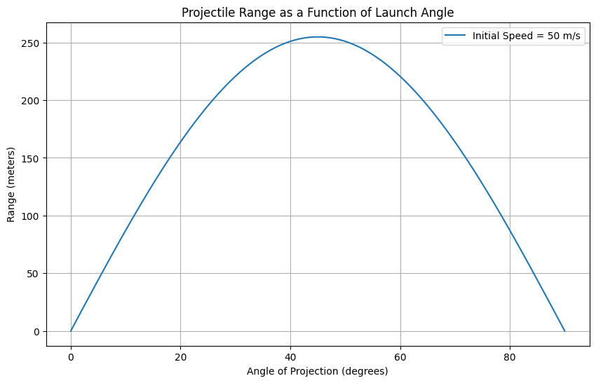

Great catch! The issue you're seeing is due to using **inline LaTeX formatting** incorrectly in Markdown. When writing LaTeX equations in Markdown (especially in environments like Jupyter Notebooks or Markdown renderers), you need to wrap them properly:

---

### ✅ Correct Markdown Math Formatting:

1. **Inline equations** — use **single dollar signs**:
```markdown
This is inline math: $x(t) = v_0 \cos(\theta) \cdot t$
```

2. **Display (block) equations** — use **double dollar signs**:
```markdown
$$
x(t) = v_0 \cos(\theta) \cdot t
$$
```

---

### 🔧 Here's Your Corrected Markdown Section:

```markdown
### Horizontal Motion (x-direction):
There is no acceleration (constant velocity):  
$x(t) = v_0 \cos(\theta) \cdot t$

### Vertical Motion (y-direction):
There is constant downward acceleration due to gravity:  
$y(t) = v_0 \sin(\theta) \cdot t - \frac{1}{2} g t^2$
```

If you're using a Jupyter Notebook or any Markdown file with LaTeX rendering, this format will show the equations beautifully.

Would you like me to prepare the entire Markdown document for your project with math formatting and code combined?


Here's a starting point for your project on projectile motion. The code:

Derives and plots the horizontal range as a function of the launch angle (from 0° to 90°).

Simulates the projectile trajectory for a specific angle (e.g., 45°).

Uses ideal conditions: no air resistance, flat ground, constant gravity.

Next steps could include:

Varying initial velocity and observing the effect.

Adding air resistance (e.g., using a drag coefficient).

Simulating on uneven terrain or with wind.