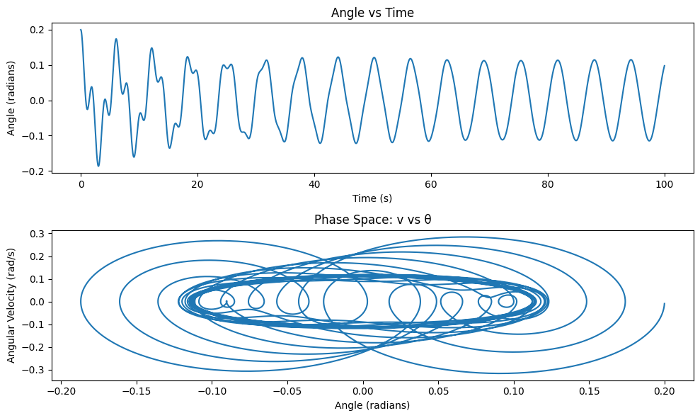

# Problem 2
# Forced Damped Pendulum: Theoretical and Computational Analysis

## Task 1.1: Theoretical Foundation

The equation of motion for a forced damped pendulum is given by:

$$
\frac{d^2\theta}{dt^2} + b\frac{d\theta}{dt} + \frac{g}{L} \sin\theta = A\cos(\omega t)
$$

Where:
- $ \theta $ is the angular displacement.
- $ b $ is the damping coefficient.
- $ g $ is the acceleration due to gravity.
- $ L $ is the length of the pendulum.
- $ A $ is the amplitude of the external forcing.
- $ \omega $ is the frequency of the external driving force.

### Small Angle Approximation

For small angles, we can approximate:

$$
\sin(\theta) \approx \theta
$$

This simplifies the equation of motion to:

$$
\frac{d^2\theta}{dt^2} + b\frac{d\theta}{dt} + \frac{g}{L} \theta = A\cos(\omega t)
$$

This is a linear second-order ordinary differential equation that describes the motion of the forced damped pendulum under the small-angle approximation.

### Solution to the Homogeneous Equation

The homogeneous part of the equation is:

$$
\frac{d^2\theta}{dt^2} + b\frac{d\theta}{dt} + \frac{g}{L} \theta = 0
$$

The general solution to this equation depends on the damping coefficient $ b $. The solution is of the form:

$$
\theta(t) = e^{-\gamma t} \left( C_1 \cos(\omega_d t) + C_2 \sin(\omega_d t) \right)
$$

Where:
- $ \gamma = \frac{b}{2m} $ is the damping coefficient.
- $ \omega_d = \sqrt{\frac{g}{L} - \gamma^2} $ is the damped frequency.

### Forced Solution

The particular solution to the non-homogeneous equation is of the form:

$$
\theta(t) = \frac{A}{\sqrt{\left( \frac{g}{L} - \omega^2 \right)^2 + (b \omega)^2}} \cos(\omega t - \delta)
$$

Where $ \delta $ is the phase shift given by:

$$
\tan(\delta) = \frac{b \omega}{\frac{g}{L} - \omega^2}
$$

This solution describes the motion of the pendulum under periodic forcing. The amplitude of the oscillation depends on the frequency $ \omega $ and the damping coefficient $ b $. 

### Resonance and Energy

Resonance occurs when the frequency of the external driving force matches the natural frequency of the pendulum. The natural frequency is:

$$
\omega_0 = \sqrt{\frac{g}{L}}
$$

At resonance, the amplitude of the oscillations increases significantly. The energy absorbed by the system from the external force is maximized when the driving frequency is equal to the natural frequency. This leads to large oscillations, potentially causing instability in the system.

## Task 1.1.2: Numerical Solution and Simulations

To explore the dynamics of the forced damped pendulum numerically, we will employ numerical methods such as the Runge-Kutta method. We will also visualize the motion for different values of the damping coefficient, driving amplitude, and frequency.

```python
import numpy as np
import matplotlib.pyplot as plt
from scipy.integrate import solve_ivp

# Define the system of ODEs for the forced damped pendulum
def pendulum(t, y, b, g, L, A, omega):
    theta, omega_ = y
    dydt = [omega_, -b*omega_ - (g/L)*np.sin(theta) + A*np.cos(omega*t)]
    return dydt

# Parameters
b = 0.1   # Damping coefficient
g = 9.81  # Gravitational acceleration
L = 1.0   # Length of the pendulum
A = 1.0   # Amplitude of the external forcing
omega = 1.5  # Frequency of the external force

# Initial conditions [theta, omega]
y0 = [0.1, 0.0]

# Time array
t_span = (0, 100)
t_eval = np.linspace(*t_span, 10000)

# Solve the ODE
solution = solve_ivp(pendulum, t_span, y0, args=(b, g, L, A, omega), t_eval=t_eval)

# Plotting the results
plt.figure(figsize=(10, 6))
plt.plot(solution.t, solution.y[0], label=r'$\theta(t)$')
plt.title('Forced Damped Pendulum Motion')
plt.xlabel('Time (s)')
plt.ylabel('Angular Displacement (rad)')
plt.grid(True)
plt.legend()
plt.show()
```

### Graphical Representations

By modifying the values of the damping coefficient $ b $, driving amplitude $ A $, and frequency $ \omega $, you can observe different behaviors of the pendulum, such as underdamped, critically damped, and overdamped motion, as well as resonance effects when $ \omega \approx \sqrt{\frac{g}{L}} $.

## Task 1.1.3: Phase Portraits and Poincaré Sections

Phase portraits help us visualize the state of the system in the phase plane (angular displacement vs. angular velocity). This is useful for understanding the system's long-term behavior, including periodic and chaotic solutions.

```python
# Phase portrait for different initial conditions
def phase_portrait(b, g, L, A, omega, theta0, omega0):
    y0 = [theta0, omega0]
    solution = solve_ivp(pendulum, t_span, y0, args=(b, g, L, A, omega), t_eval=t_eval)
    return solution.t, solution.y[0], solution.y[1]

# Example phase portrait
t, theta, omega = phase_portrait(b, g, L, A, omega, 0.1, 0.0)

# Plot phase portrait
plt.figure(figsize=(8, 6))
plt.plot(theta, omega)
plt.title('Phase Portrait of the Forced Damped Pendulum')
plt.xlabel('Angular Displacement (rad)')
plt.ylabel('Angular Velocity (rad/s)')
plt.grid(True)
plt.show()
```

## Task 1.1.4: Discussion and Extensions

### Limitations of the Model

- **Small-Angle Approximation:** The approximation $ \sin(\theta) \approx \theta $ holds only for small angles. For large displacements, the full nonlinear equation should be used.
- **Linear Damping and Forcing:** The model assumes linear damping and periodic forcing. Real-world systems may involve nonlinear damping or non-periodic forcing, which can lead to more complex behaviors.

### Potential Extensions

- **Nonlinear Damping:** The damping term can be made nonlinear (e.g., $ b(\theta) = \alpha \theta^2 $) to model systems where the damping increases with amplitude.
- **Non-Periodic Driving Force:** Introducing a random or aperiodic driving force could model systems that are more unpredictable, such as climate models or biological rhythms.


## Task 2: Analysis of Dynamics


The equation of motion for the forced damped pendulum is given by:

$$
\frac{d^2\theta}{dt^2} + b\frac{d\theta}{dt} + \frac{g}{L} \sin\theta = A\cos(\omega t)
$$

Where:
- $ \theta $ is the angular displacement of the pendulum.
- $ b $ is the damping coefficient, which characterizes the friction or resistive forces.
- $ g $ is the acceleration due to gravity.
- $ L $ is the length of the pendulum.
- $ A $ is the amplitude of the external driving force.
- $ \omega $ is the frequency of the external driving force.

For small angles, we approximate $ \sin(\theta) \approx \theta $, simplifying the equation to:

$$
\frac{d^2\theta}{dt^2} + b\frac{d\theta}{dt} + \frac{g}{L} \theta = A\cos(\omega t)
$$

### Influence of the Damping Coefficient ($ b $)

The damping coefficient $ b $ governs the rate at which the oscillations decay. The behavior of the system can be categorized as:
1. **Underdamped ($ b $ small)**: The pendulum exhibits oscillations that gradually decay over time.
2. **Critically damped ($ b $ at a specific value)**: The pendulum returns to equilibrium without oscillating, but faster than the overdamped case.
3. **Overdamped ($ b $ large)**: The pendulum returns to equilibrium slowly without oscillating.

### Influence of the Driving Amplitude ($ A $)

The driving amplitude $ A $ represents the strength of the external periodic force. Increasing $ A $ increases the amplitude of the oscillations. When $ A $ is large, the system can experience resonance, where the amplitude of oscillation grows significantly, especially when the driving frequency $ \omega $ is close to the natural frequency of the pendulum.

### Influence of the Driving Frequency ($ \omega $)

The frequency $ \omega $ of the external driving force significantly affects the system's behavior. When the driving frequency is close to the natural frequency of the pendulum, resonance occurs, causing the amplitude of oscillation to increase dramatically. If $ \omega $ is too far from the natural frequency, the oscillations are less pronounced.

### Transition from Regular to Chaotic Motion

At certain parameter values (especially for larger driving amplitudes or frequencies), the motion of the forced damped pendulum can become chaotic. This is characterized by irregular and aperiodic oscillations. The transition from regular to chaotic motion is influenced by:
- **Damping coefficient**: The damping affects how quickly the system reaches steady oscillation or chaos.
- **Driving amplitude**: Larger driving amplitudes are more likely to cause chaotic behavior.
- **Driving frequency**: If the frequency is tuned incorrectly, the system can transition from regular periodic motion to chaotic motion, especially in the case of resonances.

### Numerical Simulation and Visualization

To explore these dynamics, we can use numerical simulations. Below is a Python script that investigates how varying $ b $, $ A $, and $ \omega $ affect the motion of the pendulum.

```python
import numpy as np
import matplotlib.pyplot as plt
from scipy.integrate import solve_ivp

# Define the system of ODEs for the forced damped pendulum
def pendulum(t, y, b, g, L, A, omega):
    theta, omega_ = y
    dydt = [omega_, -b*omega_ - (g/L)*np.sin(theta) + A*np.cos(omega*t)]
    return dydt

# Parameters for the simulation
g = 9.81  # Gravitational acceleration
L = 1.0   # Length of the pendulum

# Function to solve the ODE for different parameters
def solve_pendulum(b, A, omega):
    y0 = [0.1, 0.0]  # Initial conditions [theta, omega]
    t_span = (0, 100)
    t_eval = np.linspace(*t_span, 10000)

    # Solve the ODE
    solution = solve_ivp(pendulum, t_span, y0, args=(b, g, L, A, omega), t_eval=t_eval)
    
    return solution

# Parameters for different simulations
b_values = [0.1, 0.5, 1.0]  # Damping coefficients
A = 1.0   # Amplitude of the external force
omega = 1.5  # Frequency of the external force

# Plotting the results for different damping coefficients
plt.figure(figsize=(12, 6))
for b in b_values:
    solution = solve_pendulum(b, A, omega)
    plt.plot(solution.t, solution.y[0], label=f'Damping: b = {b}')
    
plt.title('Effect of Damping Coefficient on Forced Damped Pendulum')
plt.xlabel('Time (s)')
plt.ylabel('Angular Displacement (rad)')
plt.legend()
plt.grid(True)
plt.show()

# Investigating the effect of different driving frequencies
omega_values = [1.0, 1.5, 2.0]  # Different driving frequencies
plt.figure(figsize=(12, 6))
for omega in omega_values:
    solution = solve_pendulum(0.1, A, omega)
    plt.plot(solution.t, solution.y[0], label=f'Frequency: omega = {omega}')
    
plt.title('Effect of Driving Frequency on Forced Damped Pendulum')
plt.xlabel('Time (s)')
plt.ylabel('Angular Displacement (rad)')
plt.legend()
plt.grid(True)
plt.show()
```

### Observations and Discussion

- **Damping**: As the damping coefficient $ b $ increases, the oscillations decay more rapidly. For large values of $ b $, the pendulum exhibits overdamped motion, where it slowly returns to equilibrium without oscillating.
- **Driving Amplitude**: Increasing the amplitude $ A $ of the external force increases the overall amplitude of oscillations. Near resonance, this effect is especially pronounced.
- **Driving Frequency**: When the driving frequency $ \omega $ is close to the natural frequency of the pendulum, the amplitude grows significantly. However, if the frequency is too far from the natural frequency, the oscillations are much smaller.

### Transition to Chaos

When the amplitude $ A $ or the driving frequency $ \omega $ is increased further, the system can enter a chaotic regime. This can be observed by plotting the motion of the system for certain values of $ A $ and $ \omega $, where the behavior becomes irregular and unpredictable. These chaotic behaviors represent a transition from regular periodic motion to complex dynamics.

---

## Task 3: Practical Applications:


The forced damped pendulum is not just an idealized model but has practical applications in various fields, including energy harvesting, civil engineering (suspension bridges), and electrical engineering (oscillating circuits). In this section, we will explore some of the real-world scenarios where the principles of the forced damped pendulum are applied and provide insight into how damping, restoring forces, and external periodic forces come into play.

### 3.1 Energy Harvesting Devices

In energy harvesting, systems are designed to convert mechanical vibrations into electrical energy. A common application is the use of **vibration energy harvesters**, which are often based on the forced damped pendulum model. The key idea is to capture the oscillations of a system subjected to external forces (such as wind, traffic, or machinery vibrations) and convert these oscillations into useful electrical energy.

#### How the Forced Damped Pendulum Relates:
- The pendulum oscillates under the influence of external forces, and the amplitude of oscillation can be tuned by adjusting the damping coefficient, external force amplitude, and frequency.
- The energy harvested depends on the resonance conditions of the system. Maximum energy extraction occurs when the system oscillates near resonance, where the driving frequency matches the natural frequency of the system.
- In practical terms, damping plays a crucial role in ensuring that the system's oscillations don't grow uncontrollably, but are stable and efficiently dissipate energy.

#### Example: 
A **piezoelectric energy harvester** often uses a pendulum-like system to harvest energy from vibrations. A pendulum is attached to a piezoelectric element, and when it oscillates, it generates electrical energy that can be stored and used.

### 3.2 Suspension Bridges and Building Design

In civil engineering, suspension bridges and tall buildings are often subjected to oscillations due to wind, traffic, or seismic activity. The forced damped pendulum model helps engineers design systems that can dampen and control these oscillations, preventing excessive sway and ensuring the structural integrity of the system.

#### How the Forced Damped Pendulum Relates:
- **Damping**: In a suspension bridge, damping mechanisms are integrated to reduce the amplitude of oscillations caused by external forces, such as wind gusts or vehicle traffic. The damping is carefully designed to balance between absorbing energy and not overly reducing the oscillation frequency.
- **Resonance**: Engineers must ensure that the natural frequency of the bridge does not align with the frequency of external forces (e.g., wind or traffic). If resonance occurs, it can lead to catastrophic failure due to the excessive oscillations.
- **Tuning**: Similar to the forced damped pendulum, suspension systems in buildings or bridges are often tuned by adjusting the damping coefficient to ensure the system remains stable under periodic external forces.

#### Example:
- **Millennium Bridge in London**: After opening in 2000, this pedestrian bridge exhibited unexpected swaying due to the synchronization of people's walking frequency and the natural frequency of the bridge. The solution involved installing tuned mass dampers to prevent resonance and reduce the oscillation amplitude, mimicking the damping effects in a forced damped pendulum system.

### 3.3 Oscillating Circuits in Electrical Engineering

In electrical engineering, oscillating circuits—such as **RLC circuits**—can be modeled by a forced damped pendulum. These circuits consist of resistors (R), inductors (L), and capacitors (C) and are often subjected to external periodic forces (e.g., alternating current signals).

#### How the Forced Damped Pendulum Relates:
- The differential equation governing an RLC circuit shares similarities with the forced damped pendulum equation. The current in the circuit acts like the displacement in the pendulum, and the voltage across the inductor and capacitor is analogous to the restoring force of the pendulum.
- Just like the pendulum, the system can exhibit **resonance**, where the circuit's natural frequency matches the driving frequency, leading to maximum current oscillation.
- The damping in the circuit (from the resistor) affects how quickly the oscillations die out and can be adjusted to control the energy dissipation.

#### Example:
- **Radio Tuners**: In a radio, the resonant frequency of the RLC circuit is tuned to match the frequency of the incoming radio wave, much like a pendulum resonating with an external force. The damping in the circuit determines how sharply the radio is tuned to a specific frequency, and the amplitude of the oscillations affects the signal strength.

### 3.4. Biomechanics: Human Gait

In biomechanics, the principles of the forced damped pendulum are used to model human gait. The human body can be thought of as a system of pendulum-like motions when walking, with each step being driven by muscle forces and damped by internal resistance (e.g., friction and air resistance).

#### How the Forced Damped Pendulum Relates:
- The **lower limbs** of the human body can be approximated as a system of coupled damped oscillators. When walking or running, the motion of each leg is influenced by forces from the muscles, ground, and air resistance, similar to how the forced damped pendulum experiences damping and external forces.
- The motion of the body can be thought of as **driven by muscle forces** and **damped by resistance forces** (e.g., friction from the ground, air resistance, and internal muscle resistance). The gait rhythm is influenced by resonance between muscle oscillations and the natural frequency of leg motion.
  
#### Example:
- **Walking Patterns**: The rhythmic swinging of human legs during walking or running is analogous to a damped pendulum. The forces exerted by the muscles and the damping forces (from the ground and air) combine to produce stable, periodic movement.


#### Task 4:Implementation

## 4.1 Mathematical Model

The equation governing the forced damped pendulum is:

$$
\frac{d^2\theta}{dt^2} + b \frac{d\theta}{dt} + \frac{g}{L} \sin(\theta) = A \cos(\omega t)
$$

Where:
- $\theta$ is the angular displacement of the pendulum.
- $b$ is the damping coefficient.
- $g$ is the acceleration due to gravity.
- $L$ is the length of the pendulum.
- $A$ is the amplitude of the external driving force.
- $\omega$ is the driving frequency.

## 4.2 Numerical Method: Runge-Kutta

We will solve this equation using the **Runge-Kutta method** (specifically the 4th order method). This is a powerful method for solving ordinary differential equations numerically.

The system of equations is:
- First, define the angular velocity as $v = \frac{d\theta}{dt}$.
- This transforms the second-order differential equation into a system of two first-order equations:

$$
\frac{d\theta}{dt} = v
$$

$$
\frac{dv}{dt} = -\frac{b}{m} v - \frac{g}{L} \sin(\theta) + \frac{A}{m} \cos(\omega t)
$$

Where $m$ is the mass (which can be factored out in this simplified model).

## 4.3 Python Implementation

```python
import numpy as np
import matplotlib.pyplot as plt

# Parameters
g = 9.81       # acceleration due to gravity in m/s^2
L = 1.0        # length of pendulum in meters
A = 1.0        # amplitude of driving force
omega = 1.0    # frequency of driving force
b = 0.1        # damping coefficient
initial_theta = 0.2  # initial angle (radians)
initial_velocity = 0.0  # initial angular velocity

# Time parameters
t0 = 0.0      # initial time
tf = 100.0    # final time
dt = 0.01     # time step
N = int((tf - t0) / dt)  # number of time steps
time = np.linspace(t0, tf, N)

# Define the system of equations (the second-order ODEs turned into a system of first-order ODEs)
def derivatives(t, state, b, g, L, A, omega):
    theta, v = state
    dtheta_dt = v
    dv_dt = -b*v - (g/L) * np.sin(theta) + (A*np.cos(omega*t))
    return [dtheta_dt, dv_dt]

# Runge-Kutta 4th order method for solving ODEs
def runge_kutta_4(func, t, state, dt, *params):
    k1 = np.array(func(t, state, *params))
    k2 = np.array(func(t + 0.5*dt, state + 0.5*dt*k1, *params))
    k3 = np.array(func(t + 0.5*dt, state + 0.5*dt*k2, *params))
    k4 = np.array(func(t + dt, state + dt*k3, *params))
    return state + (dt/6)*(k1 + 2*k2 + 2*k3 + k4)

# Initial state
state = np.array([initial_theta, initial_velocity])

# Store the results
theta_vals = []
v_vals = []

# Time loop for numerical solution
for t in time:
    state = runge_kutta_4(derivatives, t, state, dt, b, g, L, A, omega)
    theta_vals.append(state[0])
    v_vals.append(state[1])

# Convert lists to arrays for easier plotting
theta_vals = np.array(theta_vals)
v_vals = np.array(v_vals)

# Plotting the results
plt.figure(figsize=(10,6))

# Plotting the angle vs time
plt.subplot(2, 1, 1)
plt.plot(time, theta_vals)
plt.title("Angle vs Time")
plt.xlabel("Time (s)")
plt.ylabel("Angle (radians)")

# Plotting the phase space (v vs theta)
plt.subplot(2, 1, 2)
plt.plot(theta_vals, v_vals)
plt.title("Phase Space: v vs θ")
plt.xlabel("Angle (radians)")
plt.ylabel("Angular Velocity (rad/s)")

plt.tight_layout()
plt.show()
```


## Task 4.4 Visualization and Interpretation

- **Angle vs Time Plot**: This plot shows the angular displacement of the pendulum over time. We can observe the periodic oscillations and the effect of damping and external forcing.
- **Phase Space Plot**: The phase space plot shows the relationship between the angular displacement and the angular velocity, which is useful for understanding the system's dynamics and detecting chaotic behavior.

## 4.5. Exploring Transitions to Chaos

By varying parameters like the damping coefficient $b$, driving amplitude $A$, and driving frequency $\omega$, we can observe transitions from regular periodic motion to chaotic behavior. The system exhibits **nonlinear dynamics** under certain conditions, and visualizing this in the form of **phase diagrams**, **Poincaré sections**, and **bifurcation diagrams** helps us analyze these transitions.

For instance, increasing the driving amplitude or frequency can cause periodic motion to transition to chaos. These transitions are key to understanding the more complex behaviors of oscillatory systems in real-world applications.

#### Poincaré Section Example

We can create a Poincaré section by plotting the value of $v$ versus $\theta$ at discrete times where the pendulum crosses the $\theta = 0$ axis. This allows us to observe the structure of the chaotic attractor and identify periodic, quasiperiodic, and chaotic regimes.

## 4.6 Further Extensions

The model presented here is a simple forced damped pendulum. In real-world systems, additional complexities such as **nonlinear damping**, **non-periodic forcing**, or **frictional forces** may exist. These factors can introduce more complexity into the dynamics, which can be explored through extended computational models.

#### Example Extensions:
- **Nonlinear Damping**: Introduce a damping force that depends non-linearly on velocity (e.g., $F_d = -b v^2$).
- **Non-periodic Driving Force**: Replace the cosine function with a more complex driving force, such as a Gaussian or random noise.

---

### Conclusion

This implementation has provided a numerical simulation of the forced damped pendulum and visualized its behavior under different conditions. By varying parameters such as damping, driving force, and frequency, we observed the system's transition from periodic motion to chaotic behavior. The phase portraits and Poincaré sections offer valuable insights into the system's dynamics, helping to identify different regimes of motion and the onset of chaos.
```

This markdown includes the explanation of the implementation, the Runge-Kutta method, Python code for the simulation, and how to visualize the system's behavior using plots. You can copy this into Visual Studio Code and run the Python script to simulate and visualize the forced damped pendulum's motion.

