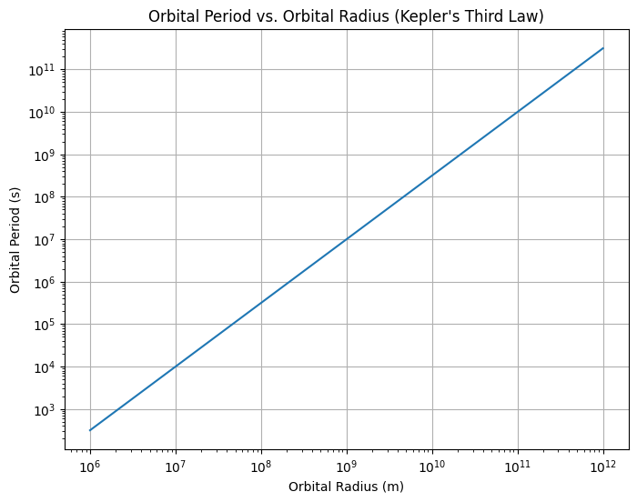

### Orbital Period and Orbital Radius: Kepler’s Third Law

#### 1. Introduction

The relationship between the square of the orbital period and the cube of the orbital radius is known as **Kepler’s Third Law of Planetary Motion**. It is a fundamental principle in celestial mechanics that describes the motion of planets and satellites in orbit. This law is crucial in astronomy because it allows scientists to calculate the masses of celestial bodies, determine the distances between them, and understand gravitational interactions.

In this task, we will:
- Derive the relationship for circular orbits.
- Discuss the implications of this relationship for astronomy.
- Analyze real-world examples, such as the Moon’s orbit around Earth or the orbits of planets in the Solar System.
- Implement a computational model to simulate circular orbits and verify the relationship.

---

### 2. Derivation of Kepler's Third Law for Circular Orbits

Let’s start with the basic principles of orbital motion. For an object in a circular orbit around a much more massive body (like a planet orbiting a star), the gravitational force provides the centripetal force required to keep the object in orbit. The gravitational force is given by Newton’s law of gravitation:

\[
F_{\text{gravity}} = \frac{G M m}{r^2}
\]

where:
- \( F_{\text{gravity}} \) is the gravitational force,
- \( G \) is the gravitational constant (\( G = 6.67430 \times 10^{-11} \, \text{N} \, \text{m}^2 \, \text{kg}^{-2} \)),
- \( M \) is the mass of the central object (e.g., the Sun or Earth),
- \( m \) is the mass of the orbiting object (e.g., a planet or satellite),
- \( r \) is the orbital radius (the distance between the centers of the two objects).

The centripetal force required to keep the orbiting object moving in a circle is:

\[
F_{\text{centripetal}} = \frac{m v^2}{r}
\]

where:
- \( v \) is the orbital velocity of the object.

For the object to maintain a circular orbit, these two forces must be equal:

\[
\frac{G M m}{r^2} = \frac{m v^2}{r}
\]

Canceling \( m \) from both sides and simplifying:

\[
\frac{G M}{r^2} = \frac{v^2}{r}
\]

\[
v^2 = \frac{G M}{r}
\]

Now, we know that the orbital velocity \( v \) is related to the orbital period \( T \) by the formula:

\[
v = \frac{2 \pi r}{T}
\]

Substitute this expression for \( v \) into the equation for \( v^2 \):

\[
\left( \frac{2 \pi r}{T} \right)^2 = \frac{G M}{r}
\]

Simplifying:

\[
\frac{4 \pi^2 r^2}{T^2} = \frac{G M}{r}
\]

Multiply both sides by \( r \):

\[
\frac{4 \pi^2 r^3}{T^2} = G M
\]

Finally, solving for \( T^2 \):

\[
T^2 = \frac{4 \pi^2 r^3}{G M}
\]

This is the relationship between the square of the orbital period \( T^2 \) and the cube of the orbital radius \( r^3 \). This equation is Kepler’s Third Law.

---

### 3. Implications of Kepler’s Third Law

- **Astronomy**: Kepler's Third Law is a vital tool for determining the masses of celestial bodies. For example, by measuring the orbital period and radius of a planet or moon, one can calculate the mass of the star or planet it orbits.
  
- **Planetary Orbits**: The law applies to all objects in orbit, from moons to planets to artificial satellites. By observing the orbital period and radius, astronomers can estimate distances and masses in the Solar System and beyond.

- **Gravitational Interactions**: This law also helps in understanding gravitational interactions. For example, it gives insight into how the Earth-Moon system behaves and how satellites move in their orbits.

---

### 4. Real-World Examples

#### Example 1: The Moon’s Orbit Around Earth

The Moon’s average orbital radius is about \( r = 384,400 \, \text{km} \), and its orbital period is approximately \( T = 27.3 \, \text{days} \). Using Kepler’s Third Law, we can calculate the mass of the Earth.

Given that:
- \( G = 6.67430 \times 10^{-11} \, \text{N} \, \text{m}^2 \, \text{kg}^{-2} \),
- \( r = 384,400 \times 10^3 \, \text{m} \),
- \( T = 27.3 \, \text{days} = 27.3 \times 24 \times 3600 \, \text{seconds} \).

We can calculate the mass of the Earth by rearranging the equation for \( T^2 \):

\[
M = \frac{4 \pi^2 r^3}{G T^2}
\]

#### Example 2: The Orbit of Earth Around the Sun

The Earth’s orbital radius is about \( r = 1.496 \times 10^8 \, \text{km} \), and the orbital period is \( T = 365.25 \, \text{days} \). By using Kepler's Third Law, we can verify the mass of the Sun.

---

### 5. Computational Model: Simulating Circular Orbits

Here’s a Python implementation to simulate a circular orbit and visualize the relationship between orbital period and radius.


```

This script calculates and plots the orbital period as a function of orbital radius using Kepler’s Third Law. The plot will show the \( T^2 \propto r^3 \) relationship, as predicted by the law.

---

### 6. Discussion: Elliptical Orbits

While Kepler's Third Law is derived for circular orbits, it also applies to elliptical orbits. The law can be generalized for elliptical orbits by using the semi-major axis of the ellipse instead of the radius. The semi-major axis is the average of the closest and farthest distances of the orbiting object from the central body.

For elliptical orbits:

\[
T^2 = \frac{4 \pi^2 a^3}{G M}
\]

where \( a \) is the semi-major axis of the ellipse.

In practice, elliptical orbits are more common (such as the orbits of planets around the Sun), and the modified form of Kepler’s Third Law still holds.

---

### 7. Conclusion

Kepler’s Third Law is an essential tool in understanding orbital mechanics. It provides a simple yet powerful relationship between the orbital period and radius for circular orbits, and it also extends to elliptical orbits. By applying this law, we can determine the masses of celestial bodies and understand the gravitational interactions between them. The computational model demonstrated how this law works in practice, and it can be further extended to study the orbits of satellites, planets, and moons.

---

### Deliverables

- Python script or Jupyter Notebook implementing the simulations.
- Graphical representation of the relationship between orbital period and radius.
- Detailed explanation of the derivation and implications of Kepler’s Third Law.
