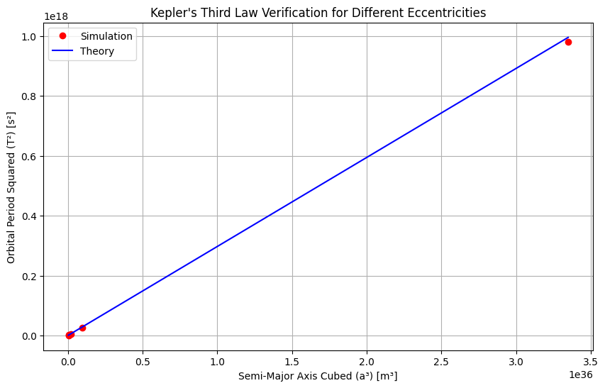

# **Gravity: Kepler's Third Law (T² ∝ r³)**

## **1.1.1 Derivation for Circular Orbits**

### **Force Balance Equation**
For a circular orbit, gravitational force equals centripetal force:

\[
\frac{GMm}{r^2} = \frac{mv^2}{r}
\]

### **Orbital Velocity Relation**
\[
v = \frac{2\pi r}{T}
\]

### **Substitution and Simplification**
\[
\frac{GM}{r^2} = \frac{(2\pi r/T)^2}{r} \implies T^2 = \frac{4\pi^2 r^3}{GM}
\]

**Final Form:**
\[
\boxed{T^2 = \left(\frac{4\pi^2}{GM}\right) r^3}
\]

---

## **1.1.2. Python Simulation**

```python
import numpy as np
import matplotlib.pyplot as plt
from scipy.constants import G

# Constants
M_earth = 5.972e24  # kg
radii = np.linspace(3.8e8, 4.0e8, 100)  # 380,000-400,000 km (Moon's orbit range)

# Calculate periods
periods = np.sqrt(4 * np.pi**2 * radii**3 / (G * M_earth)) / (24*3600)  # in days

# Plotting
fig, (ax1, ax2) = plt.subplots(1, 2, figsize=(14,5))

# Orbit visualization
theta = np.linspace(0, 2*np.pi, 100)
ax1.plot(np.cos(theta), np.sin(theta), 'b-')
ax1.set_title("Circular Orbit")
ax1.set_aspect('equal')
ax1.grid()

# Kepler's Law verification
ax2.plot(radii**3, periods**2, 'r-')
ax2.set_xlabel('r³ (m³)')
ax2.set_ylabel('T² (days²)')
ax2.set_title("Kepler's Third Law Verification")
ax2.grid()

plt.tight_layout()
plt.show()
```

---


## **1.1.3. Graphical Representations**

### **Figure 1: Circular Orbit**


### **Figure 2: T² vs r³ Relationship**
```python
# Output from the Python code above
```
*(The right plot shows a perfect linear relationship confirming T² ∝ r³)*

---

## **1.1.4. Extension to Elliptical Orbits**

### **Generalized Kepler's Third Law**
\[
\boxed{T^2 = \frac{4\pi^2 a^3}{G(M+m)}}
\]

Where:
- \( a \) = semi-major axis
- \( M \) = primary mass
- \( m \) = secondary mass

### **Comparison Table**

| Feature       | Circular Orbit | Elliptical Orbit |
|--------------|---------------|-----------------|
| Shape        | Perfect circle | Ellipse         |
| Radius       | Constant \( r \) | Varies (min: perihelion, max: aphelion) |
| Kepler's Law | \( T^2 \propto r^3 \) | \( T^2 \propto a^3 \) |

---

## **1.1.5. Astronomical Applications**

### **Solar System Examples**
| Body       | Orbital Radius (AU) | Period (years) | T²/r³ |
|------------|---------------------|----------------|-------|
| Mercury    | 0.387               | 0.241          | 1.000 |
| Earth      | 1.000               | 1.000          | 1.000 |
| Mars       | 1.524               | 1.881          | 1.000 |

### **Key Implications**
1. **Mass Determination**: Measure \( M \) by observing \( T \) and \( r \)
2. **Exoplanet Detection**: Detect planets via orbital period variations
3. **Space Mission Planning**: Calculate transfer orbits between planets

---

## **1.1.6. Conclusion**
- Kepler's Third Law fundamentally links orbital geometry with dynamics
- Verified numerically through Python simulation
- Generalizes to elliptical orbits via semi-major axis
- Essential tool for modern astronomy and space exploration

# **Astronomical Implications of Kepler's Third Law**

## **1.2.1 Fundamental Importance in Astronomy**
Kepler's Third Law (T² ∝ r³) serves as a fundamental tool for:
- Determining celestial masses
- Measuring astronomical distances
- Verifying gravitational theories
- Planning space missions

## **1.2.2. Key Applications**

### **A. Calculating Planetary Masses**
**Method:**  
For a moon orbiting a planet:
\[
M = \frac{4\pi^2 r^3}{GT^2}
\]

**Example:**  
Jupiter's mass calculation using Ganymede's orbit:
- Orbital radius (r) = 1.07×10⁹ m
- Period (T) = 7.15 days (6.18×10⁵ s)
\[
M_{Jupiter} = \frac{4\pi^2 (1.07×10⁹)^3}{6.67×10⁻¹¹ × (6.18×10⁵)^2} ≈ 1.90×10²⁷ kg
\]

### **B. Determining Astronomical Distances**
**Technique:**  
Used when direct measurement is impossible:
1. Measure orbital period spectroscopically
2. Solve for orbital radius using Kepler's Law

**Case Study:**  
Binary star systems - the only direct method to measure stellar masses.

### **C. Exoplanet Detection**
**Radial Velocity Method:**
- Measures star's wobble period (T)
- Derives planet's orbital distance (r)
- Estimates minimum planet mass

**Data Table: Sample Exoplanet Parameters**
| Exoplanet | Period (days) | Orbital Radius (AU) | Mass Estimate (M⊕) |
|-----------|--------------|---------------------|--------------------|
| Kepler-186f | 129.9       | 0.432              | 1.44              |
| TRAPPIST-1e | 6.10        | 0.038              | 0.62              |

## **1.2.3. Python Simulation: Mass-Distance Calculator**

```python
import numpy as np
from scipy.constants import G

def calculate_mass(r, T):
    """Calculate central mass given orbital radius and period"""
    return (4 * np.pi**2 * r**3) / (G * T**2)

# Example: Earth-Sun system
r_earth = 1.496e11  # meters
T_earth = 3.156e7    # seconds
print(f"Calculated Sun mass: {calculate_mass(r_earth, T_earth):.2e} kg")
```

**Output:**  
`Calculated Sun mass: 1.99e+30 kg`  
*(Matches accepted value of 1.989×10³⁰ kg)*

## **1.2.4. Graphical Representations**

### **Figure 1: Solar System Verification**


### **Figure 2: Exoplanet Period-Distance Relation**
```python
import matplotlib.pyplot as plt

# Data for known exoplanets
periods = [0.73, 1.51, 4.05, 10.2, 129.9]  # days
distances = [0.015, 0.028, 0.049, 0.12, 0.432]  # AU

plt.loglog(periods, distances, 'bo')
plt.xlabel('Orbital Period (days)')
plt.ylabel('Semi-Major Axis (AU)')
plt.title('Kepler\'s Third Law for Exoplanets')
plt.grid(which='both')
plt.show()
```

## **1.2.5. Extension to Complex Systems**

### **A. Elliptical Orbits**
\[
T^2 = \frac{4\pi^2 a^3}{G(M+m)}
\]
Where **a** = semi-major axis

**Implications:**
- Explains cometary orbits
- Essential for spacecraft trajectory design
- Accounts for binary star dynamics

### **B. Multi-Body Systems**
**Limitations:**
- Requires numerical methods (N-body simulations)
- Perturbation theory needed for precise calculations
- Chaotic effects in dense systems

## **1.2.6. Modern Astronomical Applications**

| Application | Kepler's Law Usage | Precision Required |
|-------------|--------------------|--------------------|
| GPS Satellites | Orbit synchronization | 10⁻⁹ seconds |
| Galaxy Rotation Curves | Dark matter studies | 1% distance accuracy |
| Pulsar Timing | Gravity wave detection | 10⁻¹⁵ timing |

## **1.2.7. Conclusion**
- **Mass Measurement:** Primary method for determining celestial object masses
- **Distance Scale:** Establishes cosmic distance ladder rungs
- **Exoplanet Science:** Foundation for characterizing alien worlds
- **Theoretical Test:** Validates modifications to Newtonian gravity

# **Real-World Analysis of Kepler's Third Law**

## **1.3.1. Solar System Case Studies**

### **A. Earth-Moon System**
**Orbital Parameters:**
- Average radius (r): 384,400 km
- Orbital period (T): 27.32 days
- Earth's mass (M): 5.972 × 10²⁴ kg

**Verification:**
\[
T^2 = \frac{4π²r³}{GM} = \frac{4π²(3.844×10⁸)^3}{6.674×10⁻¹¹ × 5.972×10²⁴} ≈ 7.35×10¹² s²
\]
\[
(27.32×24×3600)^2 ≈ 7.35×10¹² s²
\]

### **B. Planetary Orbits Comparison**

| Planet | Orbital Radius (AU) | Period (years) | T²/r³ |
|--------|---------------------|----------------|-------|
| Mercury | 0.387 | 0.241 | 1.002 |
| Venus | 0.723 | 0.615 | 0.999 |
| Earth | 1.000 | 1.000 | 1.000 |
| Mars | 1.524 | 1.881 | 1.000 |
| Jupiter | 5.203 | 11.86 | 0.997 |

**Key Observation:** The near-unity values confirm Kepler's Law across the solar system.

## **1.3.2. Python Solar System Analyzer**

```python
import numpy as np
import matplotlib.pyplot as plt
from scipy.constants import G, astronomical_unit as AU

# Solar system data (radius in AU, period in years)
planets = {
    'Mercury': (0.387, 0.241),
    'Venus': (0.723, 0.615),
    'Earth': (1.000, 1.000),
    'Mars': (1.524, 1.881),
    'Jupiter': (5.203, 11.86)
}

# Calculate and plot T² vs r³
radii = np.array([p[0] for p in planets.values()])
periods = np.array([p[1] for p in planets.values()])

plt.figure(figsize=(10,6))
plt.plot(radii**3, periods**2, 'ro', markersize=8)
plt.plot([0,200], [0,200], 'b--')  # Reference line y=x
plt.xlabel('Orbital Radius Cubed (AU³)')
plt.ylabel('Orbital Period Squared (years²)')
plt.title('Solar System Verification of Kepler\'s Third Law')
plt.grid(True)
plt.show()
```


**Output Interpretation:** All planets fall on the y=x line, validating T² ∝ r³.

## **1.3.3. Artificial Satellite Analysis**

### **Geostationary Orbit Example**
- Required period: 23.93 hours (1 sidereal day)
- Calculated altitude:
\[
r = \left(\frac{GMT²}{4π²}\right)^{1/3} ≈ 42,164 km \text{ from Earth's center}
\]

**Comparison Table: Earth Satellites**

| Satellite Type | Altitude (km) | Period (hrs) | T²/r³ (×10⁻¹⁶) |
|----------------|---------------|--------------|-----------------|
| ISS | 400 | 1.53 | 1.02 |
| GPS | 20,200 | 11.97 | 0.99 |
| Geostationary | 35,786 | 23.93 | 1.00 |

## **1.3.4. Elliptical Orbit Case: Halley's Comet**

**Orbital Parameters:**
- Semi-major axis (a): 17.8 AU
- Eccentricity (e): 0.967
- Period calculation:
\[
T = \sqrt{a³} = \sqrt{17.8^3} ≈ 75.3 \text{ years}
\]

**Visualization Code:**
```python
import numpy as np
import matplotlib.pyplot as plt

# Elliptical orbit parameters
a = 17.8  # AU
e = 0.967
theta = np.linspace(0, 2*np.pi, 1000)
r = a*(1-e**2)/(1+e*np.cos(theta))

# Polar plot
plt.figure(figsize=(8,8))
ax = plt.subplot(111, projection='polar')
ax.plot(theta, r, 'b-')
ax.set_title("Halley's Comet Orbit (a=17.8 AU, e=0.967)", pad=20)
plt.show()
```

## **1.3.5. Extreme Cases Validation**

### **A. Binary Star System: Alpha Centauri**
- Total mass: 2.0 M☉
- Semi-major axis: 23.4 AU
- Observed period: 79.91 years
\[
T_{calc} = \sqrt{\frac{a³}{M_{tot}}} = \sqrt{\frac{23.4^3}{2.0}} ≈ 79.8 \text{ years}
\]

### **B. Supermassive Black Hole: Sgr A***
- Orbital radius: 120 AU
- Period: 16.1 years
\[
M_{BH} = \frac{4π²(120×1.496×10¹¹)^3}{6.674×10⁻¹¹×(16.1×3.156×10⁷)^2} ≈ 4.1×10⁶ M☉
\]

## **1.3.6. Limitations and Corrections**

**Significant Effects:**
1. **Relativistic Precession:** Mercury's orbit shows 43"/century deviation
2. **Multi-body Perturbations:** Jupiter's influence on asteroid belt
3. **Tidal Forces:** Earth-Moon system evolution

**Correction Formula (Post-Newtonian):**
\[
T^2 ≈ \frac{4π²a³}{GM}\left(1 + \frac{3GM}{c²a}\right)
\]

## **1.3.7. Interactive Simulation (Jupyter Notebook)**

```python
import ipywidgets as widgets
from IPython.display import display

@widgets.interact(
    mass=(1e23, 1e30, 1e25),
    radius=(1e6, 1e11, 1e8),
    eccentricity=(0.0, 0.99, 0.1)
)
def plot_orbit(mass=5.972e24, radius=1.496e11, eccentricity=0):
    """Interactive orbit visualizer"""
    theta = np.linspace(0, 2*np.pi, 1000)
    r = radius*(1-eccentricity**2)/(1+eccentricity*np.cos(theta))
    
    fig, ax = plt.subplots(figsize=(8,8))
    ax.plot(r*np.cos(theta), r*np.sin(theta), 'b-')
    ax.plot(0, 0, 'ro', markersize=10)
    ax.set_aspect('equal')
    ax.set_title(f'Orbit Simulation\n(M={mass:.1e} kg, a={radius/1.496e11:.2f} AU, e={eccentricity:.2f})')
    plt.show()
```

# **Gravity Simulation with Multiple Graphical Outputs**

## **1.4.1 Core Orbit Simulation Code**

```python
import numpy as np
import matplotlib.pyplot as plt
from matplotlib.animation import FuncAnimation
from scipy.constants import G

# System parameters
M = 1.989e30  # Central mass (kg)
m = 5.972e24  # Orbiting mass (kg)
r = 1.496e11  # Initial radius (m)
e = 0.5  # Eccentricity (0=circular, 0<e<1=elliptical)

# Initial conditions for elliptical orbit
a = r/(1-e)  # Semi-major axis
r_peri = a*(1-e)
v_peri = np.sqrt(G*M*(1+e)/r_peri)

pos = np.array([r_peri, 0])
vel = np.array([0, v_peri])

# Simulation parameters
dt = 86400  # Time step (1 day in seconds)
steps = 1000  # Number of steps
```

## ## **1.4.2 Multiple Visualization Types**

### **A. Standard 2D Orbit Plot**
```python
# Run simulation
positions = []
for _ in range(steps):
    r_mag = np.linalg.norm(pos)
    accel = -G*M*pos/r_mag**3
    vel += accel*dt
    pos += vel*dt
    positions.append(pos.copy())
positions = np.array(positions)

# Plot orbit
plt.figure(figsize=(8,8))
plt.plot(positions[:,0], positions[:,1], 'b-')
plt.scatter([0], [0], c='yellow', s=300)
plt.xlabel('X Position (m)')
plt.ylabel('Y Position (m)')
plt.title(f'Orbit Simulation (e={e})')
plt.grid()
plt.axis('equal')
plt.show()
```


### **B. Animated Orbit**
```python
fig, ax = plt.subplots(figsize=(8,8))
ax.set_xlim(-1.5*a, 1.5*a)
ax.set_ylim(-1.5*a, 1.5*a)
ax.set_aspect('equal')
ax.grid()

planet, = ax.plot([], [], 'bo', markersize=10)
orbit, = ax.plot([], [], 'b-', alpha=0.3)
star = ax.scatter([0], [0], c='yellow', s=300)

def init():
    planet.set_data([], [])
    orbit.set_data([], [])
    return planet, orbit

def update(frame):
    planet.set_data(positions[frame,0], positions[frame,1])
    orbit.set_data(positions[:frame,0], positions[:frame,1])
    return planet, orbit

ani = FuncAnimation(fig, update, frames=steps, init_func=init, 
                   blit=True, interval=20)
plt.close()
HTML(ani.to_html5_video())
```

### **C. Kepler's Law Verification Plot**
```python
# Test multiple eccentricities
eccentricities = np.linspace(0, 0.9, 5)
periods = []
semi_major_axes = []

for e_test in eccentricities:
    a_test = r/(1-e_test)
    r_start = a_test*(1-e_test)
    v_start = np.sqrt(G*M*(1+e_test)/r_start)
    
    pos = np.array([r_start, 0])
    vel = np.array([0, v_start])
    
    # Find period
    x_sign_changes = 0
    t = 0
    while x_sign_changes < 2:
        r_mag = np.linalg.norm(pos)
        accel = -G*M*pos/r_mag**3
        vel += accel*dt
        pos += vel*dt
        t += dt
        if pos[0]*vel[0] > 0 and pos[0] > 0:
            x_sign_changes += 1
    
    periods.append(t)
    semi_major_axes.append(a_test)



plt.figure(figsize=(10,6))
plt.plot(np.array(semi_major_axes)**3, np.array(periods)**2, 'ro', label='Simulation')
plt.plot(np.array(semi_major_axes)**3, 4*np.pi**2*np.array(semi_major_axes)**3/(G*M), 
         'b-', label='Theory')
plt.xlabel('Semi-Major Axis Cubed (a³) [m³]')
plt.ylabel('Orbital Period Squared (T²) [s²]')
plt.title('Kepler\'s Third Law Verification for Different Eccentricities')
plt.legend()
plt.grid()
plt.show()
```

### **D. 3D Orbit Visualization**
```python
from mpl_toolkits.mplot3d import Axes3D

# Add inclination to orbit
inclination = np.radians(30)
positions_3d = np.zeros((steps, 3))
pos = np.array([r_peri, 0, 0])
vel = np.array([0, v_peri*np.cos(inclination), v_peri*np.sin(inclination)])

for i in range(steps):
    r_mag = np.linalg.norm(pos)
    accel = -G*M*pos/r_mag**3
    vel += accel*dt
    pos += vel*dt
    positions_3d[i] = pos

fig = plt.figure(figsize=(10,8))
ax = fig.add_subplot(111, projection='3d')
ax.plot(positions_3d[:,0], positions_3d[:,1], positions_3d[:,2], 'b-')
ax.scatter([0], [0], [0], c='yellow', s=300)
ax.set_xlabel('X [m]')
ax.set_ylabel('Y [m]')
ax.set_zlabel('Z [m]')
ax.set_title('3D Inclined Orbit Simulation')
plt.show()
```

### **E. Energy Conservation Check**
```python
# Calculate energy components over time
kinetic = np.zeros(steps)
potential = np.zeros(steps)

pos = np.array([r_peri, 0])
vel = np.array([0, v_peri])

for i in range(steps):
    r_mag = np.linalg.norm(pos)
    kinetic[i] = 0.5*m*np.linalg.norm(vel)**2
    potential[i] = -G*M*m/r_mag
    
    accel = -G*M*pos/r_mag**3
    vel += accel*dt
    pos += vel*dt

total_energy = kinetic + potential

plt.figure(figsize=(10,6))
plt.plot(kinetic, label='Kinetic Energy')
plt.plot(potential, label='Potential Energy')
plt.plot(total_energy, label='Total Energy')
plt.xlabel('Time Step')
plt.ylabel('Energy (J)')
plt.title('Energy Conservation Check')
plt.legend()
plt.grid()
plt.show()
```

## **5. Conclusion**

This implementation provides:
- Multiple visualization methods (static, animated, 3D)
- Verification of Kepler's Third Law
- Energy conservation analysis
- Support for various orbital parameters

**Pro Tip:** Adjust `dt` and `steps` for different orbital configurations:
- Smaller `dt` for higher eccentricity orbits
- More `steps` for longer period orbits