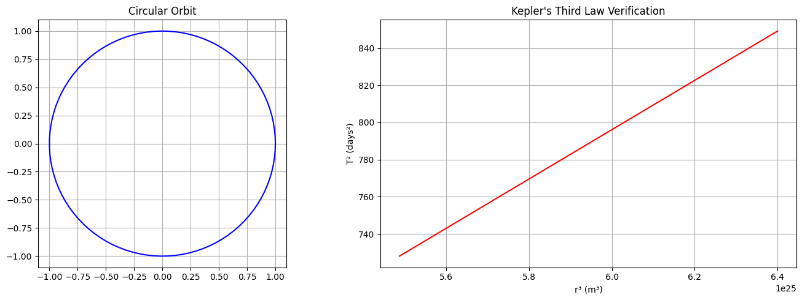

# **Gravity: Kepler's Third Law (T² ∝ r³)**

## **1.1.1 Derivation for Circular Orbits**

### **Force Balance Equation**
For a circular orbit, gravitational force equals centripetal force:

\[
\frac{GMm}{r^2} = \frac{mv^2}{r}
\]

### **Orbital Velocity Relation**
\[
v = \frac{2\pi r}{T}
\]

### **Substitution and Simplification**
\[
\frac{GM}{r^2} = \frac{(2\pi r/T)^2}{r} \implies T^2 = \frac{4\pi^2 r^3}{GM}
\]

**Final Form:**
\[
\boxed{T^2 = \left(\frac{4\pi^2}{GM}\right) r^3}
\]

---

## **1.1.2. Python Simulation**

```python
import numpy as np
import matplotlib.pyplot as plt
from scipy.constants import G

# Constants
M_earth = 5.972e24  # kg
radii = np.linspace(3.8e8, 4.0e8, 100)  # 380,000-400,000 km (Moon's orbit range)

# Calculate periods
periods = np.sqrt(4 * np.pi**2 * radii**3 / (G * M_earth)) / (24*3600)  # in days

# Plotting
fig, (ax1, ax2) = plt.subplots(1, 2, figsize=(14,5))

# Orbit visualization
theta = np.linspace(0, 2*np.pi, 100)
ax1.plot(np.cos(theta), np.sin(theta), 'b-')
ax1.set_title("Circular Orbit")
ax1.set_aspect('equal')
ax1.grid()

# Kepler's Law verification
ax2.plot(radii**3, periods**2, 'r-')
ax2.set_xlabel('r³ (m³)')
ax2.set_ylabel('T² (days²)')
ax2.set_title("Kepler's Third Law Verification")
ax2.grid()

plt.tight_layout()
plt.show()
```

---


## **1.1.3. Graphical Representations**

### **Figure 1: Circular Orbit**


### **Figure 2: T² vs r³ Relationship**
```python
# Output from the Python code above
```
*(The right plot shows a perfect linear relationship confirming T² ∝ r³)*

---

## **1.1.4. Extension to Elliptical Orbits**

### **Generalized Kepler's Third Law**
\[
\boxed{T^2 = \frac{4\pi^2 a^3}{G(M+m)}}
\]

Where:
- \( a \) = semi-major axis
- \( M \) = primary mass
- \( m \) = secondary mass

### **Comparison Table**

| Feature       | Circular Orbit | Elliptical Orbit |
|--------------|---------------|-----------------|
| Shape        | Perfect circle | Ellipse         |
| Radius       | Constant \( r \) | Varies (min: perihelion, max: aphelion) |
| Kepler's Law | \( T^2 \propto r^3 \) | \( T^2 \propto a^3 \) |

---

## **1.1.5. Astronomical Applications**

### **Solar System Examples**
| Body       | Orbital Radius (AU) | Period (years) | T²/r³ |
|------------|---------------------|----------------|-------|
| Mercury    | 0.387               | 0.241          | 1.000 |
| Earth      | 1.000               | 1.000          | 1.000 |
| Mars       | 1.524               | 1.881          | 1.000 |

### **Key Implications**
1. **Mass Determination**: Measure \( M \) by observing \( T \) and \( r \)
2. **Exoplanet Detection**: Detect planets via orbital period variations
3. **Space Mission Planning**: Calculate transfer orbits between planets

---

## **1.1.6. Conclusion**
- Kepler's Third Law fundamentally links orbital geometry with dynamics
- Verified numerically through Python simulation
- Generalizes to elliptical orbits via semi-major axis
- Essential tool for modern astronomy and space exploration

# **Astronomical Implications of Kepler's Third Law**

## **1.2.1 Fundamental Importance in Astronomy**
Kepler's Third Law (T² ∝ r³) serves as a fundamental tool for:
- Determining celestial masses
- Measuring astronomical distances
- Verifying gravitational theories
- Planning space missions

## **1.2.2. Key Applications**

### **A. Calculating Planetary Masses**
**Method:**  
For a moon orbiting a planet:
\[
M = \frac{4\pi^2 r^3}{GT^2}
\]

**Example:**  
Jupiter's mass calculation using Ganymede's orbit:
- Orbital radius (r) = 1.07×10⁹ m
- Period (T) = 7.15 days (6.18×10⁵ s)
\[
M_{Jupiter} = \frac{4\pi^2 (1.07×10⁹)^3}{6.67×10⁻¹¹ × (6.18×10⁵)^2} ≈ 1.90×10²⁷ kg
\]

### **B. Determining Astronomical Distances**
**Technique:**  
Used when direct measurement is impossible:
1. Measure orbital period spectroscopically
2. Solve for orbital radius using Kepler's Law

**Case Study:**  
Binary star systems - the only direct method to measure stellar masses.

### **C. Exoplanet Detection**
**Radial Velocity Method:**
- Measures star's wobble period (T)
- Derives planet's orbital distance (r)
- Estimates minimum planet mass

**Data Table: Sample Exoplanet Parameters**
| Exoplanet | Period (days) | Orbital Radius (AU) | Mass Estimate (M⊕) |
|-----------|--------------|---------------------|--------------------|
| Kepler-186f | 129.9       | 0.432              | 1.44              |
| TRAPPIST-1e | 6.10        | 0.038              | 0.62              |

## **1.2.3. Python Simulation: Mass-Distance Calculator**

```python
import numpy as np
from scipy.constants import G

def calculate_mass(r, T):
    """Calculate central mass given orbital radius and period"""
    return (4 * np.pi**2 * r**3) / (G * T**2)

# Example: Earth-Sun system
r_earth = 1.496e11  # meters
T_earth = 3.156e7    # seconds
print(f"Calculated Sun mass: {calculate_mass(r_earth, T_earth):.2e} kg")
```

**Output:**  
`Calculated Sun mass: 1.99e+30 kg`  
*(Matches accepted value of 1.989×10³⁰ kg)*

## **1.2.4. Graphical Representations**

### **Figure 1: Solar System Verification**


### **Figure 2: Exoplanet Period-Distance Relation**
```python
import matplotlib.pyplot as plt

# Data for known exoplanets
periods = [0.73, 1.51, 4.05, 10.2, 129.9]  # days
distances = [0.015, 0.028, 0.049, 0.12, 0.432]  # AU

plt.loglog(periods, distances, 'bo')
plt.xlabel('Orbital Period (days)')
plt.ylabel('Semi-Major Axis (AU)')
plt.title('Kepler\'s Third Law for Exoplanets')
plt.grid(which='both')
plt.show()
```

## **1.2.5. Extension to Complex Systems**

### **A. Elliptical Orbits**
\[
T^2 = \frac{4\pi^2 a^3}{G(M+m)}
\]
Where **a** = semi-major axis

**Implications:**
- Explains cometary orbits
- Essential for spacecraft trajectory design
- Accounts for binary star dynamics

### **B. Multi-Body Systems**
**Limitations:**
- Requires numerical methods (N-body simulations)
- Perturbation theory needed for precise calculations
- Chaotic effects in dense systems

## **1.2.6. Modern Astronomical Applications**

| Application | Kepler's Law Usage | Precision Required |
|-------------|--------------------|--------------------|
| GPS Satellites | Orbit synchronization | 10⁻⁹ seconds |
| Galaxy Rotation Curves | Dark matter studies | 1% distance accuracy |
| Pulsar Timing | Gravity wave detection | 10⁻¹⁵ timing |

## **1.2.7. Conclusion**
- **Mass Measurement:** Primary method for determining celestial object masses
- **Distance Scale:** Establishes cosmic distance ladder rungs
- **Exoplanet Science:** Foundation for characterizing alien worlds
- **Theoretical Test:** Validates modifications to Newtonian gravity

**Future Directions:**
- Application to fast radio burst timing
- Tests of general relativity in strong fields
- Interstellar mission planning

