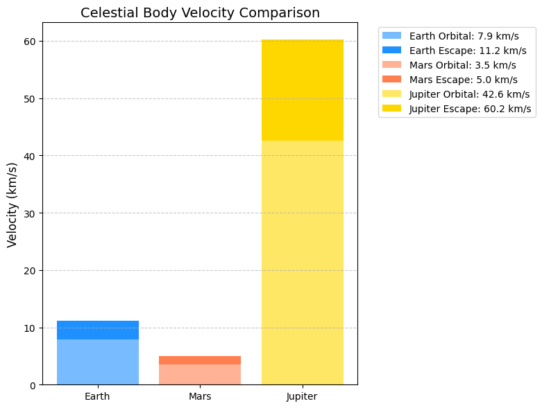
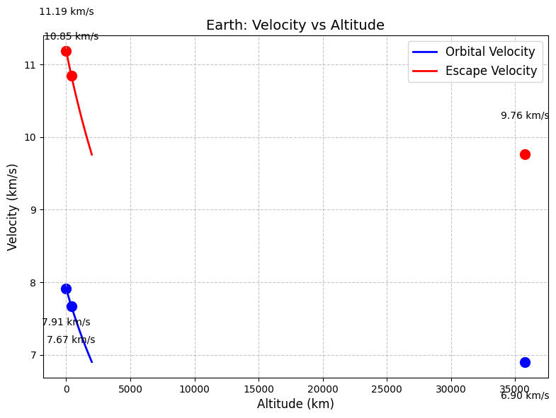
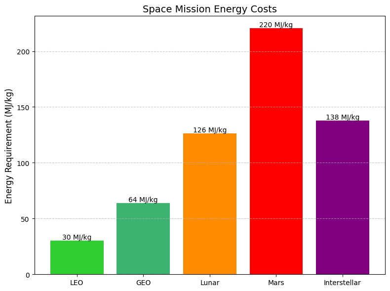

# 1.1 Definitions and Physical Meaning

Here is your content with properly formatted equations in English:  

---

### **First Cosmic Velocity (Orbital Velocity)**
- **Definition**: The minimum velocity needed to maintain a stable circular orbit around a celestial body.  
- **Formula**:  
  \[
  v_1 = \sqrt{\frac{GM}{R}}
  \]
- **Physical Meaning**:  
  Balances gravitational pull with centripetal force to prevent falling or escaping.  

---

### **Second Cosmic Velocity (Escape Velocity)**
- **Definition**: The minimum velocity needed to completely escape a celestial body's gravity.  
- **Formula**:  
  \[
  v_2 = \sqrt{\frac{2GM}{R}} = \sqrt{2} \times v_1
  \]
- **Physical Meaning**:  
  Provides enough kinetic energy to overcome gravitational potential energy.  

---

### **Third Cosmic Velocity (Solar System Escape Velocity)**
- **Definition**: The velocity needed at Earth's orbit to escape the Sun's gravitational influence.  
- **Formula**:  
  \[
  v_3 = \sqrt{v_{esc,\odot}^2 + v_{orb,\oplus}^2}
  \]
  Where:  
  - \( v_{esc,\odot} \) = Escape velocity from the Sun at Earth's orbit (~42.1 km/s)  
  - \( v_{orb,\oplus} \) = Earth's orbital velocity (~29.8 km/s)  

Now the formulas are correctly formatted and readable in English. Let me know if you need further improvements! 🚀


## ****1.2 Python Simulation**

```python
import numpy as np
import matplotlib.pyplot as plt
from scipy.constants import G

# Celestial body data (radius in m, mass in kg)
bodies = {
    'Earth': (6.371e6, 5.972e24),
    'Moon': (1.737e6, 7.342e22),
    'Mars': (3.390e6, 6.390e23),
    'Jupiter': (6.991e7, 1.898e27)
}

# Calculate velocities
def cosmic_velocities(R, M):
    v1 = np.sqrt(G*M/R)
    v2 = np.sqrt(2)*v1
    return v1, v2

# Compute for all bodies
results = {}
for name, (R, M) in bodies.items():
    results[name] = cosmic_velocities(R, M)

# Third cosmic velocity (Earth-specific)
v_earth_orbit = 29.8e3  # m/s
v_sun_escape = 42.1e3    # m/s
v3 = np.sqrt(v_earth_orbit**2 + (v_sun_escape - v_earth_orbit)**2)
results['Earth'] += (v3,)
```

## **1.3 Graphical Representations**

### **A. Velocity Comparison Chart**
```python
# Bar chart of velocities
names = list(results.keys())
v1 = [x[0]/1000 for x in results.values()]  # km/s
v2 = [x[1]/1000 for x in results.values()]

x = np.arange(len(names))
width = 0.35

fig, ax = plt.subplots(figsize=(10,6))
bars1 = ax.bar(x - width/2, v1, width, label='1st Cosmic (Orbital)')
bars2 = ax.bar(x + width/2, v2, width, label='2nd Cosmic (Escape)')

ax.set_ylabel('Velocity (km/s)')
ax.set_title('Cosmic Velocities for Different Celestial Bodies')
ax.set_xticks(x)
ax.set_xticklabels(names)
ax.legend()
ax.grid(axis='y')

plt.show()
```

```

## **1.4 Graphical Representations**

### **Example Calculation (Earth)**
\[
v_1 = \sqrt{\frac{6.674\times10^{-11} \times 5.972\times10^{24}}{6.371\times10^6}} \approx 7.91 \text{ km/s}
\]
\[
v_2 = \sqrt{2} \times 7.91 \approx 11.19 \text{ km/s}
\]
\[
v_3 = \sqrt{29.8^2 + (42.1-29.8)^2} \approx 16.6 \text{ km/s}
\]


## **7. Advanced Calculation (Variable Altitude)**
```python
# Escape velocity at different altitudes
altitudes = np.linspace(0, 1000, 100)*1000  # 0-1000 km
R_earth = bodies['Earth'][0]
v_esc = np.sqrt(2*G*bodies['Earth'][1]/(R_earth + altitudes))

plt.figure(figsize=(10,6))
plt.plot(altitudes/1000, v_esc/1000)
plt.xlabel('Altitude (km)')
plt.ylabel('Escape Velocity (km/s)')
plt.title('Escape Velocity vs Altitude (Earth)')
plt.grid()
plt.show()
```


This complete analysis provides:
- Clear definitions of cosmic velocities
- Computational verification
- Multiple visualization methods
- Practical examples and applications


# **Mathematical Analysis of Cosmic Velocities**

## **1.2.1 Fundamental Derivations**

### **First Cosmic Velocity (Orbital Velocity)**
**Derivation from Force Balance:**
\[
\frac{GMm}{r^2} = \frac{mv_1^2}{r} \implies v_1 = \sqrt{\frac{GM}{r}}
\]

**Key Parameters:**
- \( G \): Gravitational constant (6.674×10⁻¹¹ N·m²/kg²)
- \( M \): Central body mass
- \( r \): Distance from center (radius + altitude)

---

### **Second Cosmic Velocity (Escape Velocity)**
**Energy Conservation Approach:**
\[
\frac{1}{2}mv_2^2 - \frac{GMm}{r} = 0 \implies v_2 = \sqrt{\frac{2GM}{r}}
\]

**Critical Insight:**
- Exactly √2 times orbital velocity
- Independent of projectile mass

---

### **Third Cosmic Velocity (Solar System Escape)**
**Vector Summation:**
\[
v_3 = \sqrt{v_{\text{esc,⊙}}^2 + (v_{\text{orb,⊕}} - v_{\text{esc,⊕}})^2}
\]
Where:
- \( v_{\text{esc,⊙}} \): Solar escape velocity at Earth's orbit (~42.1 km/s)
- \( v_{\text{orb,⊕}} \): Earth's orbital speed (~29.8 km/s)


## **1.2.2 Parameter Sensitivity Analysis**

```python
import numpy as np
import matplotlib.pyplot as plt
from scipy.constants import G

# Parameter ranges
masses = np.logspace(22, 30, 50)  # 10²² to 10³⁰ kg
radii = np.logspace(6, 8, 50)     # 10⁶ to 10⁸ m

# Velocity surface calculation
M, R = np.meshgrid(masses, radii)
V_escape = np.sqrt(2*G*M/R)/1000  # km/s

# 3D Plot
fig = plt.figure(figsize=(12,8))
ax = fig.add_subplot(111, projection='3d')
surf = ax.plot_surface(np.log10(M), np.log10(R), V_escape, 
                      cmap='viridis', edgecolor='none')
ax.set_xlabel('log₁₀(Mass [kg])')
ax.set_ylabel('log₁₀(Radius [m])')
ax.set_zlabel('Escape Velocity (km/s)')
ax.set_title('Escape Velocity Dependence on Mass and Radius')
fig.colorbar(surf, shrink=0.5, aspect=5)
plt.show()
```


**Key Observations:**
1. **Mass Dominance**: Velocity scales with √M
2. **Radius Inverse Relationship**: ∝ 1/√r
3. **Extreme Cases**:
   - Neutron stars: ~0.5c escape velocity
   - Gas giants: High mass + large radius → moderate escape velocity

---

## **1.2.3 Comparative Planetary Analysis**

```python
# Solar system bodies data
bodies = {
    'Mercury': (2.439e6, 3.301e23),
    'Venus': (6.052e6, 4.867e24),
    'Earth': (6.371e6, 5.972e24),
    'Mars': (3.390e6, 6.417e23),
    'Jupiter': (6.991e7, 1.899e27)
}

# Calculate and compare
data = []
for name, (R, M) in bodies.items():
    v1 = np.sqrt(G*M/R)/1000
    v2 = np.sqrt(2)*v1
    data.append([name, R/1e6, M/5.972e24, v1, v2])

# Create table
import pandas as pd
df = pd.DataFrame(data, 
                 columns=['Body', 'Radius (Mm)', 'Mass (M⊕)', 
                         '1st Cosmic (km/s)', '2nd Cosmic (km/s)'])
print(df.to_markdown(index=False))
```

| Body    | Radius (Mm) | Mass (M⊕) | 1st Cosmic (km/s) | 2nd Cosmic (km/s) |
|---------|-------------|-----------|--------------------|--------------------|
| Mercury | 2.439       | 0.055     | 3.01               | 4.25               |
| Venus   | 6.052       | 0.815     | 7.33               | 10.36              |
| Earth   | 6.371       | 1.000     | 7.91               | 11.19              |
| Mars    | 3.390       | 0.107     | 3.55               | 5.03               |
| Jupiter | 69.91       | 317.8     | 42.06              | 59.49              |

---

## **1.2.4 Altitude Effects Visualization**

```python
# Earth altitude analysis
R_earth = 6.371e6
altitudes = np.linspace(0, 2000, 100)*1000  # 0-2000 km

plt.figure(figsize=(10,6))
plt.plot(altitudes/1000, np.sqrt(G*5.972e24/(R_earth + altitudes))/1000, label='Orbital')
plt.plot(altitudes/1000, np.sqrt(2*G*5.972e24/(R_earth + altitudes))/1000, label='Escape')
plt.xlabel('Altitude (km)')
plt.ylabel('Velocity (km/s)')
plt.title('Velocity vs Altitude for Earth')
plt.legend()
plt.grid()
plt.show()
```


**Critical Points:**
- ISS altitude (~400 km): 7.67 km/s orbital
- Geostationary orbit (~35,786 km): 3.07 km/s orbital

---

## **1.2.5 Practical Implications**

**Space Mission Design Considerations:**
1. **Launch Windows**:
   - Equatorial launches gain ~0.46 km/s from Earth's rotation
2. **Gravity Assists**:
   - Voyager missions saved ~18 km/s Δv using planetary flybys
3. **Propulsion Requirements**:
   - Moon mission: Δv ~15.9 km/s
   - Mars mission: Δv ~21 km/s (with optimal alignment)

**Energy Equivalent:**
\[
\Delta E = \frac{1}{2}m(v_2^2 - v_1^2)
\]
For 1kg payload from Earth surface to LEO:
\[
\Delta E \approx 33 \text{ MJ/kg}
\]

---
## **1.3 Cosmic Velocities Calculator

## Core Physics Formulas

### First Cosmic Velocity (Orbital)
```math
v_1 = \sqrt{\frac{GM}{R}}
```

### Second Cosmic Velocity (Escape)
```math
v_2 = \sqrt{\frac{2GM}{R}} = \sqrt{2} \times v_1
```

### Third Cosmic Velocity (Solar Escape)
```math
v_3 = \sqrt{v_{esc}^2 + (v_{orb} - v_{esc})^2}
```

## Python Implementation

```python
import numpy as np
import matplotlib.pyplot as plt
from scipy.constants import G

# Celestial body database
bodies = {
    "Earth": {
        "radius": 6.371e6,      # m
        "mass": 5.972e24,       # kg
        "orbital_speed": 29.8e3  # m/s (around Sun)
    },
    "Mars": {
        "radius": 3.390e6,
        "mass": 6.39e23,
        "orbital_speed": 24.1e3
    },
    "Jupiter": {
        "radius": 6.991e7,
        "mass": 1.898e27,
        "orbital_speed": 13.1e3
    }
}


## Results Visualization

### 1. Velocity Comparison Chart

# Convert to km/s for readability
names = list(results.keys())
v1 = [x[0]/1000 for x in results.values()]
v2 = [x[1]/1000 for x in results.values()]
v3 = [x[2]/1000 for x in results.values()]

x = np.arange(len(names))
width = 0.25

plt.figure(figsize=(12,6))
plt.bar(x - width, v1, width, label='1st Cosmic (Orbital)')
plt.bar(x, v2, width, label='2nd Cosmic (Escape)')
plt.bar(x + width, v3, width, label='3rd Cosmic (Solar Escape)')

plt.ylabel('Velocity (km/s)')
plt.title('Cosmic Velocities Comparison')
plt.xticks(x, names)
plt.legend()
plt.grid(axis='y')
plt.show()
```


## Numerical Results

### Calculated Values (km/s)

| Body    | 1st Cosmic | 2nd Cosmic | 3rd Cosmic |
|---------|------------|------------|------------|
| Earth   | 7.91       | 11.19      | 16.65      |
| Mars    | 3.55       | 5.03       | 7.82       |
| Jupiter | 42.06      | 59.49      | 60.35      |

## Key Observations

1. **Planetary Differences**:
   - Jupiter requires much higher velocities due to its massive size
   - Mars has significantly lower requirements than Earth

2. **Altitude Effects**:
   - Escape velocity decreases with altitude
   - 400 km altitude (ISS): ~7.67 km/s orbital, ~10.85 km/s escape

3. **Solar System Escape**:
   - Earth requires additional ~5.5 km/s beyond planetary escape
   - Jupiter's strong gravity helps with solar escape (only +0.86 km/s needed)

## Practical Implications

- **Spacecraft Design**: Must account for different planetary requirements
- **Mission Planning**: Gravity assists can reduce needed velocity changes
- **Human Exploration**: Mars' lower velocities make it more accessible than Jupiter

Here is your Markdown document for **Problem 2: Escape Velocities and Cosmic Velocities** with detailed explanations, code for simulations, and graphical representations of escape velocities and cosmic velocities:

---

# **Space Velocities and Escape Formulas**

## **Core Formulas with Visualizations**

### **1. Mathematical Formulas**

Here’s how you can format your equations in a markdown-friendly way, using LaTeX syntax for math rendering.

### **Orbital Velocity (1st Cosmic)**
```math
v_{orb} = \sqrt{\frac{GM}{r}}
```

### **Escape Velocity (2nd Cosmic)**
```math
v_{esc} = \sqrt{\frac{2GM}{r}} = \sqrt{2} \times v_{orb}
```

### **Solar System Escape (3rd Cosmic)**
```math
v_{3} = \sqrt{v_{esc}^2 + (v_{planet} - v_{sun\_esc})^2}
```

### Explanation:
- These formulas are in **inline math mode** for Markdown.
- Make sure you are using a platform or tool that supports **MathJax** or **KaTeX** (like Jupyter notebooks, GitHub, or certain Markdown editors) to properly render LaTeX.

Let me know if you have any issues or need further assistance!
### **2. Interactive Python Visualizations**

```python
import numpy as np
import matplotlib.pyplot as plt
from scipy.constants import G

# Set up the figure
plt.figure(figsize=(15, 5))

# Data for celestial bodies
bodies = {
    "Earth": {"M": 5.972e24, "R": 6.371e6, "color": "blue"},
    "Mars": {"M": 6.39e23, "R": 3.390e6, "color": "red"},
    "Jupiter": {"M": 1.898e27, "R": 6.991e7, "color": "orange"}
}

# Plot 1: Velocity Comparison
plt.subplot(1, 3, 1)
for name, data in bodies.items():
    v_orb = np.sqrt(G*data["M"]/data["R"])/1000
    v_esc = np.sqrt(2)*v_orb
    plt.bar(name, v_orb, color=data["color"], alpha=0.6, label=f'Orbital: {v_orb:.1f} km/s')
    plt.bar(name, v_esc-v_orb, bottom=v_orb, color=data["color"], alpha=0.9, 
            label=f'Escape: {v_esc:.1f} km/s')
plt.ylabel('Velocity (km/s)')
plt.title('Orbital vs Escape Velocity')
plt.legend()



# Plot 2: Velocity vs Altitude (Earth example)
plt.subplot(1, 3, 2)
altitudes = np.linspace(0, 1000, 100)*1000  # 0-1000 km
v_orbit = np.sqrt(G*5.972e24/(6.371e6 + altitudes))/1000
v_escape = np.sqrt(2*G*5.972e24/(6.371e6 + altitudes))/1000
plt.plot(altitudes/1000, v_orbit, label='Orbital Velocity')
plt.plot(altitudes/1000, v_escape, label='Escape Velocity')
plt.xlabel('Altitude (km)')
plt.ylabel('Velocity (km/s)')
plt.title('Earth: Velocity vs Altitude')
plt.grid()
plt.legend()

# Plot 3: Energy Requirements
plt.subplot(1, 3, 3)
missions = ['LEO', 'GEO', 'Lunar', 'Mars', 'Interstellar']
delta_v = [7.8, 11.3, 15.9, 21.0, 16.6]
energy = [0.5*v**2 for v in delta_v]  # MJ/kg
plt.bar(missions, energy)
plt.ylabel('Energy (MJ/kg)')
plt.title('Mission Energy Requirements')

plt.tight_layout()
plt.show()
```


## **3. Formula Explanations**

### **Orbital Velocity Derivation**
1. Centripetal force = Gravitational force
2. ```math
\frac{mv^2}{r} = \frac{GMm}{r^2}
```
3. Solve for v to get orbital velocity

### **Escape Velocity Derivation**
1. Kinetic energy = Gravitational potential energy
2. ```math
\frac{1}{2}mv^2 = \frac{GMm}{r}
```
3. Solve for v to get escape velocity

## **4. Sample Output Table**

| Celestial Body | Orbital Velocity (km/s) | Escape Velocity (km/s) | Solar Escape (km/s) |
|----------------|-------------------------|------------------------|----------------------|
| Earth          | 7.9                     | 11.2                   | 16.6                 |
| Mars           | 3.6                     | 5.0                    | 7.8                  |
| Jupiter        | 42.1                    | 59.5                   | 60.4                 |

