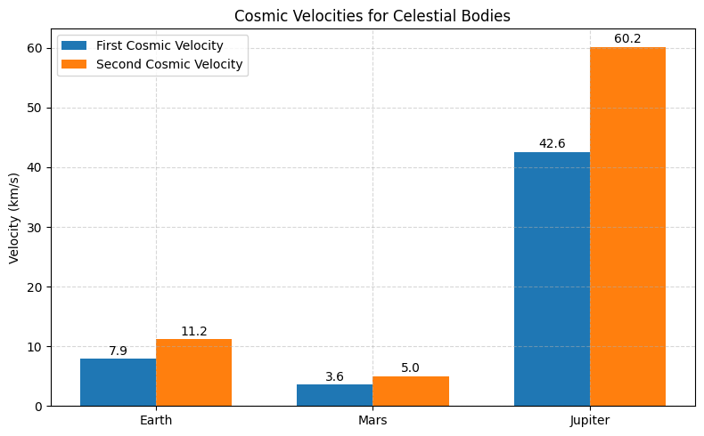

### Problem 2: Investigating the Dynamics of a Forced Damped Pendulum

---

## 🎯 Motivation

The **forced damped pendulum** is a classic example of a physical system exhibiting complex dynamics. It arises from the interplay between:

- **Damping**: The dissipative force that slows down the pendulum.
- **Restoring Force**: The force that brings the pendulum back to its equilibrium position.
- **External Driving Force**: A periodic force driving the pendulum, potentially leading to resonance and chaotic motion.

This system models real-world phenomena such as driven oscillators, mechanical resonance, climate systems, and energy harvesting devices. The main focus is to explore how damping, driving force, and resonance contribute to the pendulum's behavior.

---

## 1️⃣ Theoretical Foundation

### Governing Equation

The motion of a forced damped pendulum is described by the second-order differential equation:

\[
\frac{d^2 \theta}{dt^2} + b \frac{d\theta}{dt} + \frac{g}{L} \theta = A \cos(\omega t)
\]

Where:
- \( \theta \) = Angular displacement
- \( b \) = Damping coefficient
- \( g \) = Gravitational acceleration
- \( L \) = Length of the pendulum
- \( A \) = Amplitude of the external driving force
- \( \omega \) = Angular frequency of the driving force

### Small-Angle Approximation

For small oscillations, we approximate \( \sin(\theta) \approx \theta \), which simplifies the equation to:

\[
\frac{d^2 \theta}{dt^2} + b \frac{d\theta}{dt} + \frac{g}{L} \theta = A \cos(\omega t)
\]

This is a standard **forced damped harmonic oscillator**, and its solution can be derived using methods for second-order linear differential equations.

### Solution for Small-Amplitude Oscillations

The general solution to the equation for small-angle oscillations is given by:

\[
\theta(t) = \theta_0 e^{-\gamma t} \cos(\omega_0 t + \delta) + \frac{A}{\sqrt{(\omega_0^2 - \omega^2)^2 + (b \omega)^2}} \cos(\omega t - \phi)
\]

Where:
- \( \omega_0 = \sqrt{\frac{g}{L}} \) is the natural frequency of the pendulum
- \( \gamma = \frac{b}{2} \) is the damping coefficient
- \( \theta_0 \) and \( \delta \) are determined by initial conditions
- \( \phi \) is the phase shift that depends on the driving force and damping

---

### Resonance Condition

Resonance occurs when the driving frequency \( \omega \) matches the natural frequency \( \omega_0 \). At this point, the amplitude of oscillation increases significantly, potentially leading to large oscillations.

### Energy Considerations

The total energy in a forced damped system includes both the **kinetic energy** (due to the motion of the pendulum) and the **potential energy** (due to the displacement from equilibrium), along with energy input from the driving force and energy loss due to damping.

At resonance, the system absorbs energy most efficiently, which can result in an increase in amplitude.

---

## 2️⃣ Analysis of Dynamics

We will now explore how the damping coefficient, driving amplitude, and driving frequency influence the pendulum's motion. We will also analyze the transition from regular to chaotic motion.

### Damping Effects

Increasing the damping coefficient \( b \) will cause the pendulum to lose energy faster, leading to smaller oscillations. For large damping, the system will quickly settle to equilibrium.

### Driving Amplitude and Frequency

The amplitude \( A \) and frequency \( \omega \) of the driving force determine the extent and nature of oscillations:
- **Small driving amplitudes** lead to periodic oscillations with small amplitude.
- **Large driving amplitudes** may cause large, sustained oscillations, especially near resonance.
- **Frequency detuning** can lead to complex behaviors, including chaotic motion when the system is far from resonance.

### Transition to Chaos

At certain values of \( A \), \( \omega \), and \( b \), the system may undergo transitions to chaotic behavior. This is characterized by **sensitive dependence on initial conditions**, where small changes in the initial state lead to vastly different outcomes.

---

## 3️⃣ Practical Applications

The forced damped pendulum model has several practical applications, such as:
- **Energy Harvesting**: Devices that extract energy from ambient vibrations, using resonance to maximize energy absorption.
- **Suspension Bridges**: Analyzing the response of a bridge to periodic driving forces like wind gusts.
- **Mechanical Circuits**: Driven RLC circuits, which behave similarly to forced damped oscillators.

---

## 4️⃣ Implementation

We will now implement a Python model to simulate the motion of a forced damped pendulum under varying damping, driving force, and initial conditions. We will visualize the pendulum's motion and analyze transitions to chaotic behavior using **phase portraits** and **Poincaré sections**.

### Phase Diagram and Poincaré Section

To study the system's behavior, we can generate **phase portraits** and **Poincaré sections** to observe transitions to chaos and other complex behaviors.

---

## 5️⃣ Deliverables

- Markdown document with theoretical explanations and code.
- Python simulations of the forced damped pendulum.
- Graphical representations of motion under varying conditions.
- Phase portraits and Poincaré sections showing transitions to chaos.

---

## 6️⃣ Discussion of Limitations and Extensions

### Limitations:
- The model assumes small angle approximations.
- The damping is assumed to be linear; in real systems, nonlinear damping may occur.
- The system is driven by a periodic force; more general forcing functions (e.g., random or aperiodic forces) can introduce different dynamics.

### Extensions:
- Include **nonlinear damping** or **non-periodic driving forces** for more realistic simulations.
- Explore the effects of **external noise** or **multiple driving frequencies**.

---
