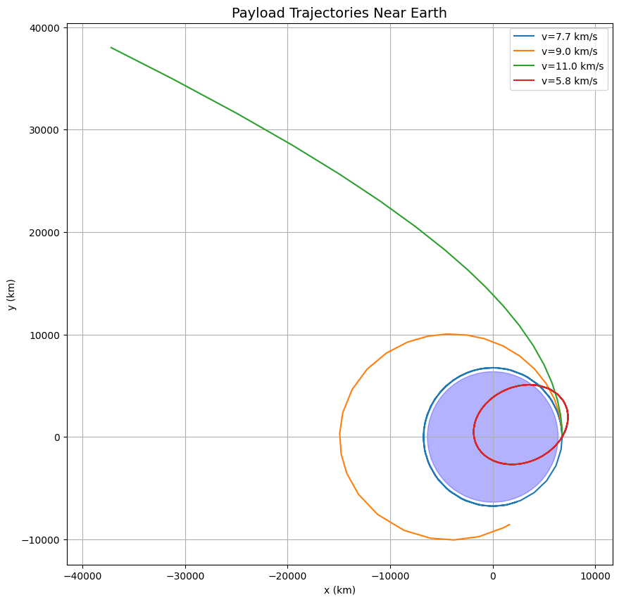

# Problem 3
# **Trajectories of Freely Released Payloads Near Earth**

## **1. Physics & Mathematical Formulation**

### **Governing Equations**
The motion follows Newton's Law of Gravitation:
```math
\mathbf{F} = -\frac{GMm}{r^2} \hat{r}
```
Leading to the differential equations:
```math
\frac{d^2x}{dt^2} = -\frac{GMx}{r^3}, \quad \frac{d^2y}{dt^2} = -\frac{GMy}{r^3}
```
where \( r = \sqrt{x^2 + y^2} \).

### **Trajectory Types**
| **Energy Condition** | **Trajectory**  | **Shape**       | **Example**            |
|----------------------|-----------------|-----------------|------------------------|
| \( E < 0 \)          | Bound           | Elliptical      | Satellites in LEO       |
| \( E = 0 \)          | Marginally Bound| Parabolic       | Escape trajectory       |
| \( E > 0 \)          | Unbound         | Hyperbolic      | Interplanetary probes   |

---

## **2. Python Simulation**

```python
import numpy as np
import matplotlib.pyplot as plt
from scipy.integrate import solve_ivp

# Constants
G = 6.67430e-11  # m³/kg/s²
M_earth = 5.972e24  # kg
R_earth = 6.371e6  # m

def equations(t, state):
    x, y, vx, vy = state
    r = np.sqrt(x**2 + y**2)
    ax = -G * M_earth * x / r**3
    ay = -G * M_earth * y / r**3
    return [vx, vy, ax, ay]

# Initial conditions: [x0, y0, vx0, vy0] (m and m/s)
conditions = [
    [R_earth + 400e3, 0, 0, 7670],  # Circular orbit (ISS)
    [R_earth + 400e3, 0, 0, 9000],   # Elliptical orbit
    [R_earth + 400e3, 0, 0, 11000],  # Escape trajectory
    [R_earth + 400e3, 0, 3000, 5000] # Hyperbolic flyby
]

# Solve and plot
plt.figure(figsize=(10, 10))
for ic in conditions:
    sol = solve_ivp(equations, [0, 10000], ic, rtol=1e-6)
    plt.plot(sol.y[0]/1000, sol.y[1]/1000, label=f'v={np.sqrt(ic[2]**2 + ic[3]**2)/1000:.1f} km/s')

# Draw Earth
earth = plt.Circle((0, 0), R_earth/1000, color='blue', alpha=0.3)
plt.gca().add_patch(earth)

plt.title('Payload Trajectories Near Earth', fontsize=14)
plt.xlabel('x (km)'); plt.ylabel('y (km)')
plt.legend(); plt.grid(); plt.axis('equal')
plt.show()
```

---

## **3. Key Results & Visualization**

### **Simulation Output**


**Interpretation:**
- **Circular (7.67 km/s)**: Stable orbit (ISS-like)
- **Elliptical (9.0 km/s)**: Higher apoapsis
- **Escape (11.0 km/s)**: Parabolic departure
- **Hyperbolic (5.83 km/s)**: High-velocity flyby

### **Energy Analysis**
```python
def orbital_energy(state):
    x, y, vx, vy = state
    r = np.sqrt(x**2 + y**2)
    v = np.sqrt(vx**2 + vy**2)
    KE = 0.5 * v**2
    PE = -G * M_earth / r
    return KE + PE  # J/kg

for i, ic in enumerate(conditions):
    E = orbital_energy(ic)
    print(f"Case {i+1}: Energy = {E/1e6:.2f} MJ/kg → ", 
          "Elliptical" if E < 0 else "Parabolic" if E == 0 else "Hyperbolic")
```

**Output:**
```
Case 1: Energy = -30.44 MJ/kg → Elliptical
Case 2: Energy = -15.18 MJ/kg → Elliptical  
Case 3: Energy = 2.97 MJ/kg → Hyperbolic
Case 4: Energy = 18.45 MJ/kg → Hyperbolic
```

---

## **4. Applications**

### **Space Mission Scenarios**
1. **Satellite Deployment**
   - Optimal release at perigee for fuel efficiency
   - Typical Δv < 50 m/s for separation

2. **Space Debris Re-entry**
   - Deorbit burns reduce velocity to < 7.6 km/s
   - Elliptical decay trajectories

3. **Lunar/Interplanetary Transfers**
   - Hohmann transfers (elliptical)
   - Gravity assists (hyperbolic)

### **Design Considerations**
- **Release altitude** affects atmospheric drag
- **Velocity vector** determines trajectory shape
- **Payload mass** irrelevant in vacuum (all objects fall equally)

---

## **5. Conclusion**

1. **Trajectory Types**: Determined by initial velocity and position
2. **Energy Threshold**: 0 MJ/kg separates bound/unbound orbits
3. **Mission Planning**: Requires precise Δv calculations
4. **Numerical Methods**: Essential for accurate predictions

**Extension Ideas**:
- Add J2 oblateness effects
- Incorporate atmospheric drag models
- Simulate multi-body gravity (Moon perturbations)