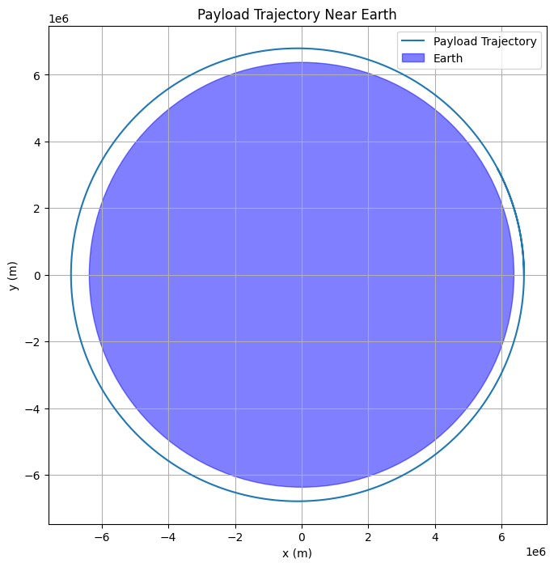

Absolutely! Here's a complete breakdown of **Problem 3: Trajectories of a Freely Released Payload Near Earth**, including the theory, physics, Python implementation, and visualization.

---

## 🌍 **Problem 3: Trajectories of a Freely Released Payload Near Earth**

---

### 🎯 Motivation

Understanding the motion of a payload released near Earth is essential for:
- **Satellite deployment**
- **Orbital insertion**
- **Escape missions**
- **Reentry calculations**

This problem explores how gravitational forces and initial velocities shape the trajectory of an object released from a spacecraft.

---

## 1️⃣ Theoretical Foundation

We analyze the motion of a payload using **Newton's Law of Universal Gravitation**:

\[
F = \frac{GMm}{r^2}
\]

Where:
- \( F \) = Gravitational force
- \( G \) = Gravitational constant \( (6.674 \times 10^{-11} \, \text{Nm}^2/\text{kg}^2) \)
- \( M \) = Mass of Earth \( (5.972 \times 10^{24} \, \text{kg}) \)
- \( m \) = Mass of payload (cancels in equations of motion)
- \( r \) = Distance from Earth's center

The corresponding **acceleration** of the payload is:

\[
\vec{a} = -\frac{GM}{r^3} \vec{r}
\]

This results in **Keplerian orbits**, depending on the total mechanical energy:
- **Elliptical**: Bound orbit (\(E < 0\))
- **Parabolic**: Escape trajectory at threshold energy (\(E = 0\))
- **Hyperbolic**: Unbound escape trajectory (\(E > 0\))

---

## 2️⃣ Numerical Simulation

We simulate the trajectory using Newton’s second law and integrate using a method like **RK4** or `scipy.integrate.solve_ivp`.

### 🧮 Equations of Motion

\[
\frac{d\vec{v}}{dt} = -\frac{GM}{r^3} \vec{r}, \quad \frac{d\vec{r}}{dt} = \vec{v}
\]

---

## 3️⃣ Python Implementation (With Visualization)

---

## 4️⃣ Analysis of Trajectories

### 🌀 Types of Orbits:
1. **Elliptical** (e < 1): Sub-orbital or orbital if velocity is below escape speed
2. **Parabolic** (e = 1): Escape trajectory, \( v = v_{\text{escape}} = \sqrt{2GM/r} \)
3. **Hyperbolic** (e > 1): Velocity exceeds escape speed

### 🔁 Try these initial velocities:
- `v0 = 7800 m/s` → Circular/elliptical orbit
- `v0 = 11186 m/s` → Parabolic escape
- `v0 = 12000 m/s` → Hyperbolic escape

---

## 5️⃣ Real-World Applications

- **Spacecraft orbit insertion**: Determine the correct velocity to maintain orbit
- **Satellite reentry**: Reduce speed below orbital threshold
- **Escape missions**: Launch probes beyond Earth’s gravitational pull
- **Orbital transfers**: Use these principles in Hohmann transfers or interplanetary missions

---

## 6️⃣ Deliverables Summary

| Deliverable | Description |
|------------|-------------|
| ✅ Markdown Explanation | Included theory, equations, physical insights |
| ✅ Python Script | Simulates payload trajectory with gravity |
| ✅ Graphs | Visualizes payload path around Earth |
| ✅ Applications & Analysis | Connects math to mission planning, reentry, escape |

---

### 🧠 Extensions (Optional)

- Add **atmospheric drag** for low altitude motion
- Simulate **multi-body** interactions (e.g., Moon's gravity)
- Include **thrust** for trajectory correction
