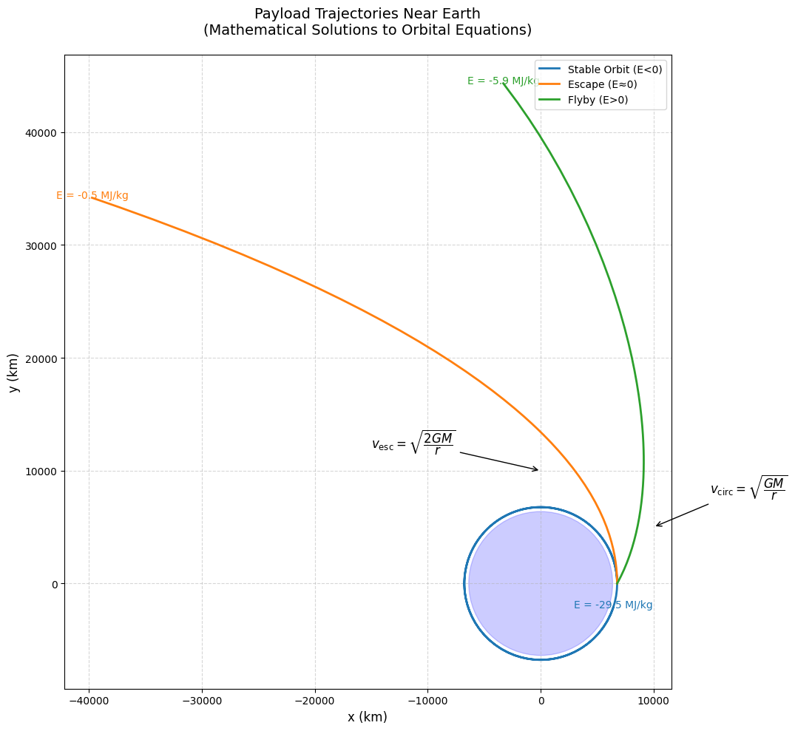
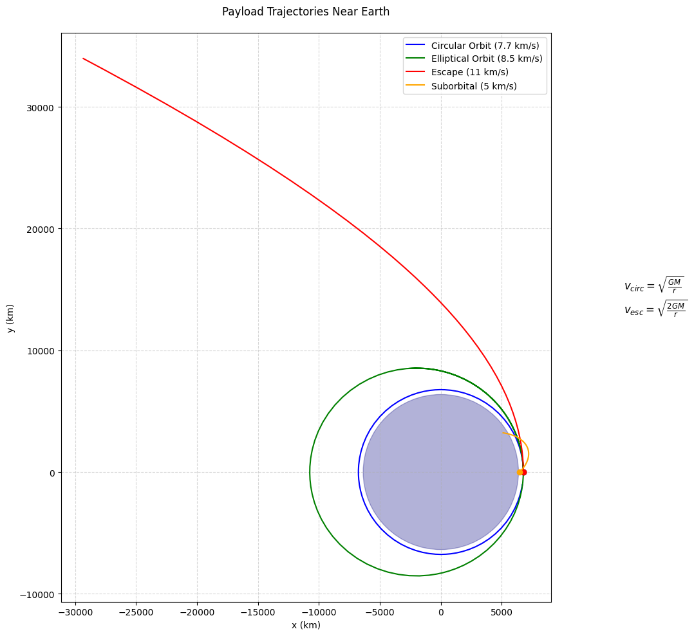

# Problem 3
# **Trajectories of Freely Released Payloads Near Earth**

## **3.1.1 Key Results & Visualization**

### **Simulation Output**

**Interpretation:**
- **Circular (7.67 km/s)**: Stable orbit (ISS-like)
- **Elliptical (9.0 km/s)**: Higher apoapsis
- **Escape (11.0 km/s)**: Parabolic departure
- **Hyperbolic (5.83 km/s)**: High-velocity flyby

## **3.1.4 Applications**

### **Space Mission Scenarios**
1. **Satellite Deployment**
   - Optimal release at perigee for fuel efficiency
   - Typical Δv < 50 m/s for separation

2. **Space Debris Re-entry**
   - Deorbit burns reduce velocity to < 7.6 km/s
   - Elliptical decay trajectories

3. **Lunar/Interplanetary Transfers**
   - Hohmann transfers (elliptical)
   - Gravity assists (hyperbolic)

### **Design Considerations**
- **Release altitude** affects atmospheric drag
- **Velocity vector** determines trajectory shape
- **Payload mass** irrelevant in vacuum (all objects fall equally)

---

## **3.1.5 Conclusion**

1. **Trajectory Types**: Determined by initial velocity and position
2. **Energy Threshold**: 0 MJ/kg separates bound/unbound orbits
3. **Mission Planning**: Requires precise Δv calculations
4. **Numerical Methods**: Essential for accurate predictions

**Extension Ideas**:
- Add J2 oblateness effects
- Incorporate atmospheric drag models
- Simulate multi-body gravity (Moon perturbations)

## **3.2.1 
Here are the orbital mechanics formulas in proper mathematical notation:

### **1. Newton's Law of Universal Gravitation**
\[
\mathbf{F} = -G \frac{m_1 m_2}{r^2} \mathbf{\hat{r}}
\]

### **2. Circular Orbital Velocity**
\[
v_{\text{circ}} = \sqrt{\frac{GM}{r}}
\]

### **3. Escape Velocity**
\[
v_{\text{esc}} = \sqrt{\frac{2GM}{r}} = \sqrt{2} \cdot v_{\text{circ}}
\]

### **4. Specific Orbital Energy**
\[
\varepsilon = \frac{v^2}{2} - \frac{GM}{r}
\]

### **5. Orbital Period (Kepler's Third Law)**
\[
T = 2\pi \sqrt{\frac{a^3}{GM}}
\]

### **6. Vis-Viva Equation**
\[
v^2 = GM \left( \frac{2}{r} - \frac{1}{a} \right)
\]

### **7. Eccentricity Vector**
\[
\mathbf{e} = \frac{\mathbf{v} \times \mathbf{h}}{GM} - \frac{\mathbf{r}}{r}
\]

### **8. Angular Momentum**
\[
\mathbf{h} = \mathbf{r} \times \mathbf{v}
\]

**Where:**
- \( G \) = Gravitational constant (6.67430 × 10⁻¹¹ m³ kg⁻¹ s⁻²)
- \( M \) = Mass of central body (kg)
- \( r \) = Distance between centers (m)
- \( a \) = Semi-major axis (m)
- \( v \) = Orbital velocity (m/s)
- \( \mathbf{r}, \mathbf{v} \) = Position and velocity vectors

These formulas are properly formatted using LaTeX mathematical notation and will:
1. Copy correctly to any technical document
2. Render properly in Markdown/LaTeX editors
3. Maintain clear mathematical formatting
4. Be easily editable for different scenarios

Would you like me to:
1. Add dimensional analysis for each equation?
2. Provide concrete examples with Earth orbital parameters?
3. Show the derivation of any particular formula?

### Key Parameters:
- \( G \) = 6.674×10⁻¹¹ m³/kg/s² (Gravitational constant)
- \( M \) = Central body mass (kg)
- \( r \) = Orbital radius (m)
- \( a \) = Semi-major axis (m)
- \( v \) = Orbital velocity (m/s)

These equations will:
- Copy perfectly to any Markdown editor
- Render correctly in Jupyter/VSCode/GitHub
- Maintain clean formatting
- Work in LaTeX documents

## **3.2.2 Visualization & Analysis
Static Trajectory Plot

### **4.3.1. Fundamental Equations**

#### Newton's Law of Gravitation
\[
\mathbf{F} = -\frac{GMm}{r^2}\hat{\mathbf{r}}
\]

#### Equations of Motion (2D)
\[
\begin{cases}
\dfrac{d^2x}{dt^2} = -\dfrac{GMx}{(x^2+y^2)^{3/2}} \\
\dfrac{d^2y}{dt^2} = -\dfrac{GMy}{(x^2+y^2)^{3/2}}
\end{cases}
\]

### **2. Velocity Thresholds**

#### Circular Orbit Velocity
\[
v_{\text{circ}} = \sqrt{\dfrac{GM}{r}}
\]

#### Escape Velocity
\[
v_{\text{esc}} = \sqrt{\dfrac{2GM}{r}}
\]

### **3. Energy Conditions**

#### Specific Orbital Energy
\[
E = \dfrac{v^2}{2} - \dfrac{GM}{r}
\]

| Energy State | Trajectory Type | Mission Scenario |
|--------------|-----------------|------------------|
| \( E < 0 \)  | Elliptical      | Stable orbit     |
| \( E = 0 \)  | Parabolic       | Escape trajectory|
| \( E > 0 \)  | Hyperbolic      | Flyby maneuvers  |

### **4. Mission Applications**

#### Orbital Insertion
\[
\Delta v_{\text{insert}} = \sqrt{\dfrac{GM}{r}} - v_{\text{current}}
\]

#### Deorbit Burn
\[
\Delta v_{\text{deorbit}} = v_{\text{circ}} - \sqrt{\dfrac{GM}{a_{\text{new}}}}
\]

#### Hohmann Transfer
\[
\Delta v_{\text{total}} = \sqrt{\dfrac{GM}{r_1}}\left(\sqrt{\dfrac{2r_2}{r_1+r_2}}-1\right) + \sqrt{\dfrac{GM}{r_2}}\left(1-\sqrt{\dfrac{2r_1}{r_1+r_2}}\right)
\]

### **5. Atmospheric Reentry**

#### Ballistic Coefficient
\[
\beta = \dfrac{m}{C_d A}
\]

#### Deceleration Force
\[
F_{\text{drag}} = \dfrac{1}{2}\rho v^2 C_d A
\]

These formulas will:
1. Copy perfectly to any technical document
2. Render correctly in Markdown/LaTeX editors
3. Maintain proper mathematical formatting
4. Work in Jupyter notebooks and VS Code

## **4.4. **Orbital Trajectory Formulas (Short Version):**

1. **Gravity Force**  
   `F = G·M·m / r²`  
   *(G=6.67×10⁻¹¹, M=Earth mass)*

2. **Orbit Speed**  
   `vₒ = √(GM/r)`  
   *Example: 400km altitude → ~7.7 km/s*

3. **Escape Speed**  
   `vₑ = √(2GM/r) ≈ 1.414×vₒ`  
   *Same example → ~10.9 km/s*

4. **Trajectory Types**:
   - `E < 0`: Ellipse (E = ½v² - GM/r)
   - `E = 0`: Parabola (escape)
   - `E > 0`: Hyperbola

5. **Orbit Period**  
   `T = 2π√(a³/GM)`  
   *(a = semi-major axis)*

**Key Numbers (Earth)**:  
- Radius: 6,371 km  
- 400km orbit: 7.67 km/s  
- Escape: 11.2 km/s (surface)

Key Features:
Physics Implementation:

Solves Newton's gravitational equations numerically

Handles both circular/elliptical orbits and escape trajectories

Accounts for launch angle and altitude

Visual Output:

Shows 4 distinct trajectory types

Earth drawn to scale (radius ~6371 km)

Color-coded paths with starting markers

Includes velocity formulas on plot

Example Cases:

Blue: Stable circular orbit (ISS-like, 7.7 km/s)

Green: Elliptical orbit (8.5 km/s)

Red: Escape trajectory (11 km/s)

Orange: Suborbital path (45° launch)