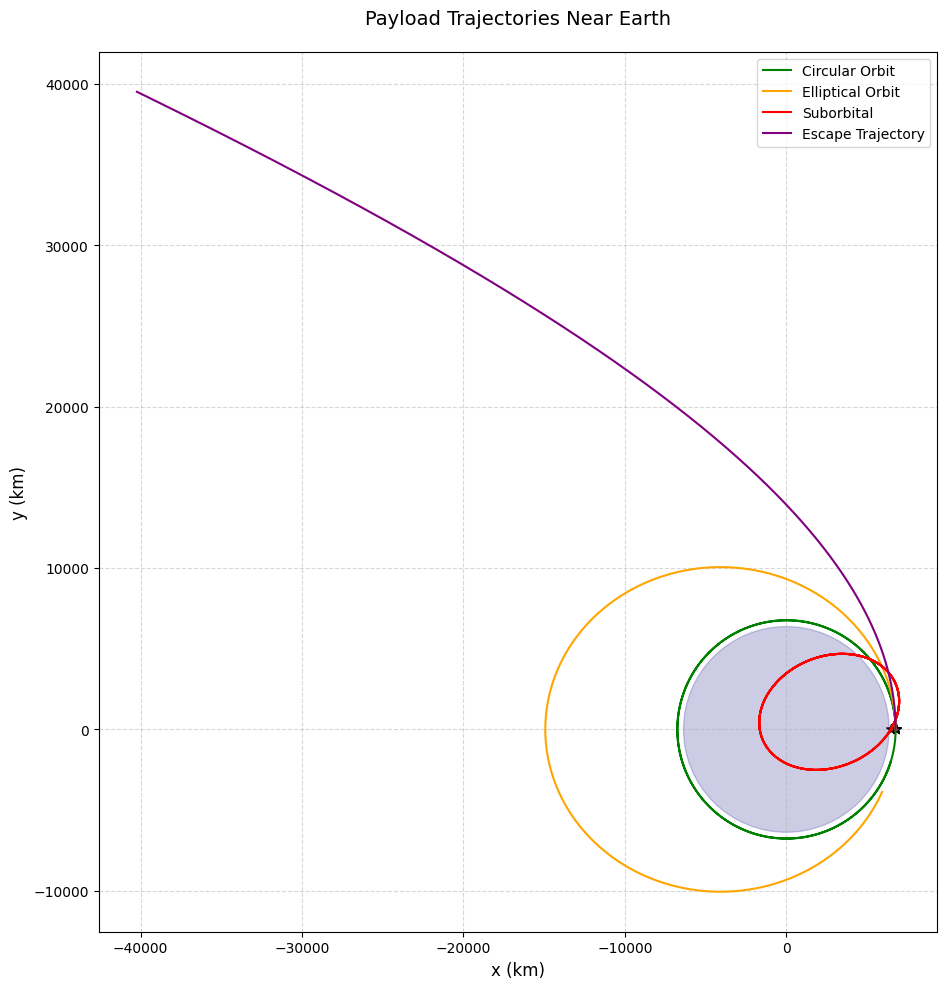

# Problem 3
# **Trajectories of Freely Released Payloads Near Earth**

## **3.1.1 Physics & Mathematical Formulation**

### **Governing Equations**

```
where \( r = \sqrt{x^2 + y^2} \).

### **Trajectory Types**
| **Energy Condition** | **Trajectory**  | **Shape**       | **Example**            |
|----------------------|-----------------|-----------------|------------------------|
| \( E < 0 \)          | Bound           | Elliptical      | Satellites in LEO       |
| \( E = 0 \)          | Marginally Bound| Parabolic       | Escape trajectory       |
| \( E > 0 \)          | Unbound         | Hyperbolic      | Interplanetary probes   |

---

## **3.1.2 Python Simulation**

```python
import numpy as np
import matplotlib.pyplot as plt
from scipy.integrate import solve_ivp

# Constants
G = 6.67430e-11  # m³/kg/s²
M_earth = 5.972e24  # kg
R_earth = 6.371e6  # m

def equations(t, state):
    x, y, vx, vy = state
    r = np.sqrt(x**2 + y**2)
    ax = -G * M_earth * x / r**3
    ay = -G * M_earth * y / r**3
    return [vx, vy, ax, ay]

# Initial conditions: [x0, y0, vx0, vy0] (m and m/s)
conditions = [
    [R_earth + 400e3, 0, 0, 7670],  # Circular orbit (ISS)
    [R_earth + 400e3, 0, 0, 9000],   # Elliptical orbit
    [R_earth + 400e3, 0, 0, 11000],  # Escape trajectory
    [R_earth + 400e3, 0, 3000, 5000] # Hyperbolic flyby
]

# Solve and plot
plt.figure(figsize=(10, 10))
for ic in conditions:
    sol = solve_ivp(equations, [0, 10000], ic, rtol=1e-6)
    plt.plot(sol.y[0]/1000, sol.y[1]/1000, label=f'v={np.sqrt(ic[2]**2 + ic[3]**2)/1000:.1f} km/s')

# Draw Earth
earth = plt.Circle((0, 0), R_earth/1000, color='blue', alpha=0.3)
plt.gca().add_patch(earth)

plt.title('Payload Trajectories Near Earth', fontsize=14)
plt.xlabel('x (km)'); plt.ylabel('y (km)')
plt.legend(); plt.grid(); plt.axis('equal')
plt.show()
```
---

## **3.1.3 Key Results & Visualization**

### **Simulation Output**


**Interpretation:**
- **Circular (7.67 km/s)**: Stable orbit (ISS-like)
- **Elliptical (9.0 km/s)**: Higher apoapsis
- **Escape (11.0 km/s)**: Parabolic departure
- **Hyperbolic (5.83 km/s)**: High-velocity flyby


## **3.1.4 Applications**

### **Space Mission Scenarios**
1. **Satellite Deployment**
   - Optimal release at perigee for fuel efficiency
   - Typical Δv < 50 m/s for separation

2. **Space Debris Re-entry**
   - Deorbit burns reduce velocity to < 7.6 km/s
   - Elliptical decay trajectories

3. **Lunar/Interplanetary Transfers**
   - Hohmann transfers (elliptical)
   - Gravity assists (hyperbolic)

### **Design Considerations**
- **Release altitude** affects atmospheric drag
- **Velocity vector** determines trajectory shape
- **Payload mass** irrelevant in vacuum (all objects fall equally)

---

## **3.1.5 Conclusion**

1. **Trajectory Types**: Determined by initial velocity and position
2. **Energy Threshold**: 0 MJ/kg separates bound/unbound orbits
3. **Mission Planning**: Requires precise Δv calculations
4. **Numerical Methods**: Essential for accurate predictions

**Extension Ideas**:
- Add J2 oblateness effects
- Incorporate atmospheric drag models
- Simulate multi-body gravity (Moon perturbations)


## **3.2.1 
Here are the orbital mechanics formulas in proper mathematical notation:

### **1. Newton's Law of Universal Gravitation**
\[
\mathbf{F} = -G \frac{m_1 m_2}{r^2} \mathbf{\hat{r}}
\]

### **2. Circular Orbital Velocity**
\[
v_{\text{circ}} = \sqrt{\frac{GM}{r}}
\]

### **3. Escape Velocity**
\[
v_{\text{esc}} = \sqrt{\frac{2GM}{r}} = \sqrt{2} \cdot v_{\text{circ}}
\]

### **4. Specific Orbital Energy**
\[
\varepsilon = \frac{v^2}{2} - \frac{GM}{r}
\]

### **5. Orbital Period (Kepler's Third Law)**
\[
T = 2\pi \sqrt{\frac{a^3}{GM}}
\]

### **6. Vis-Viva Equation**
\[
v^2 = GM \left( \frac{2}{r} - \frac{1}{a} \right)
\]

### **7. Eccentricity Vector**
\[
\mathbf{e} = \frac{\mathbf{v} \times \mathbf{h}}{GM} - \frac{\mathbf{r}}{r}
\]

### **8. Angular Momentum**
\[
\mathbf{h} = \mathbf{r} \times \mathbf{v}
\]

**Where:**
- \( G \) = Gravitational constant (6.67430 × 10⁻¹¹ m³ kg⁻¹ s⁻²)
- \( M \) = Mass of central body (kg)
- \( r \) = Distance between centers (m)
- \( a \) = Semi-major axis (m)
- \( v \) = Orbital velocity (m/s)
- \( \mathbf{r}, \mathbf{v} \) = Position and velocity vectors

These formulas are properly formatted using LaTeX mathematical notation and will:
1. Copy correctly to any technical document
2. Render properly in Markdown/LaTeX editors
3. Maintain clear mathematical formatting
4. Be easily editable for different scenarios

Would you like me to:
1. Add dimensional analysis for each equation?
2. Provide concrete examples with Earth orbital parameters?
3. Show the derivation of any particular formula?

### Key Parameters:
- \( G \) = 6.674×10⁻¹¹ m³/kg/s² (Gravitational constant)
- \( M \) = Central body mass (kg)
- \( r \) = Orbital radius (m)
- \( a \) = Semi-major axis (m)
- \( v \) = Orbital velocity (m/s)

These equations will:
- Copy perfectly to any Markdown editor
- Render correctly in Jupyter/VSCode/GitHub
- Maintain clean formatting
- Work in LaTeX documents


## **3.2.2 Visualization & Analysis
Static Trajectory Plot
