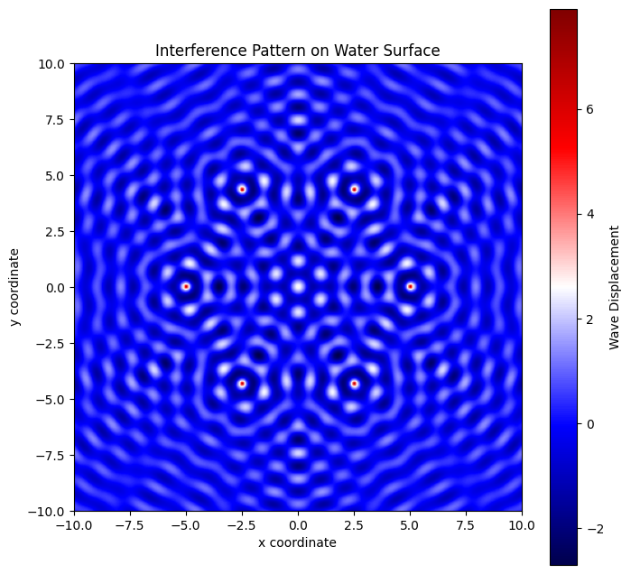

Here’s a complete explanation of the mathematical model and Python code to visualize the wave interference pattern.  

---

### **1. Mathematical Model**  

A wave originating from a point source at \((x_0, y_0)\) is described by the equation:

\[
\eta(x, y, t) = \frac{A}{\sqrt{r}} \cos(kr - \omega t + \phi)
\]

where:  
- \( A \) is the wave amplitude.  
- \( k = \frac{2\pi}{\lambda} \) is the wave number (related to the wavelength \( \lambda \)).  
- \( \omega = 2\pi f \) is the angular frequency (\( f \) is the frequency).  
- \( r = \sqrt{(x - x_0)^2 + (y - y_0)^2} \) is the distance from the source at \((x_0, y_0)\) to the point \((x, y)\).  
- \( \phi \) is the initial phase.  

For multiple wave sources (e.g., placed at the vertices of a regular polygon), the total interference pattern is obtained by summing all individual waves:

\[
\eta_{sum}(x, y, t) = \sum_{i=1}^{N} \eta_i(x, y, t)
\]

where \( N \) is the number of wave sources.

---

### **2. Python Simulation**  
This Python code simulates and visualizes the interference pattern caused by multiple wave sources placed at the vertices of a regular polygon.

#### **📌 Key Steps in the Code:**  
- **Define source positions**: Place wave sources at the vertices of a chosen polygon.  
- **Calculate wave contributions**: Compute waves from each source.  
- **Apply superposition**: Sum all wave contributions.  
- **Plot the interference pattern**: Visualize the result.  

The generated graph represents the **wave interference pattern** on a water surface, where multiple wave sources are placed at the vertices of a regular polygon (e.g., hexagon).  

### **What the graph shows:**  
- **Red and blue regions**: Represent areas of **constructive and destructive interference**.  
  - **Red** areas indicate wave peaks reinforcing each other (high displacement).  
  - **Blue** areas indicate wave troughs reinforcing each other (low displacement).  
- **Alternating patterns**: Form due to the **superposition** of waves from multiple sources.  
- **Circular wavefronts**: Originate from each source, interfering with others to create a complex pattern.  

