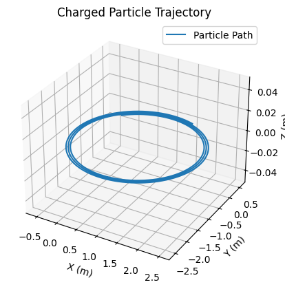

# Problem 1

Sure! Here are the **key formulas** in **English** related to the Lorentz force and particle motion in electromagnetic fields, written clearly for use in reports or simulations.

---

## 📘 Key Formulas (in English)

### **1. Lorentz Force**

$$
\vec{F} = q(\vec{E} + \vec{v} \times \vec{B})
$$

* $\vec{F}$: Force on the particle (Newtons, N)
* $q$: Electric charge (Coulombs, C)
* $\vec{E}$: Electric field (Volts/meter, V/m)
* $\vec{v}$: Velocity of the particle (meters/second, m/s)
* $\vec{B}$: Magnetic field (Tesla, T)

---

### **2. Newton’s Second Law**

$$
\vec{F} = m\vec{a} \quad \Rightarrow \quad \vec{a} = \frac{\vec{F}}{m}
$$

* $m$: Mass of the particle (kg)
* $\vec{a}$: Acceleration (m/s²)

---

### **3. Larmor Radius (Radius of Circular Motion)**

$$
r_L = \frac{mv_\perp}{|q|B}
$$

* $v_\perp$: Component of velocity perpendicular to the magnetic field
* $r_L$: Larmor radius (m)

---

### **4. Cyclotron Frequency**

$$
\omega_c = \frac{|q|B}{m}
$$

* $\omega_c$: Cyclotron angular frequency (rad/s)

---

### **5. Gyroperiod (Time for one circular orbit)**

$$
T = \frac{2\pi m}{|q|B}
$$

* $T$: Period of circular motion (seconds)

---

### **6. E × B Drift Velocity**

$$
\vec{v}_d = \frac{\vec{E} \times \vec{B}}{B^2}
$$

