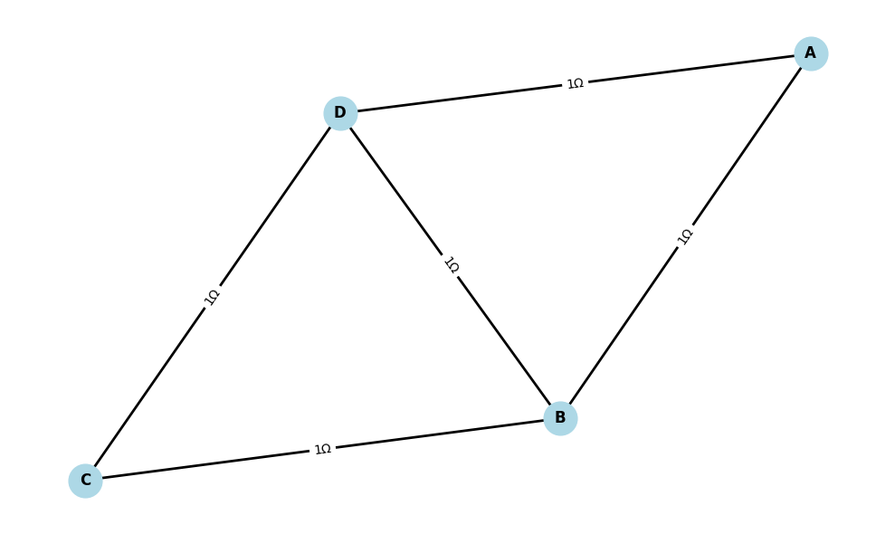
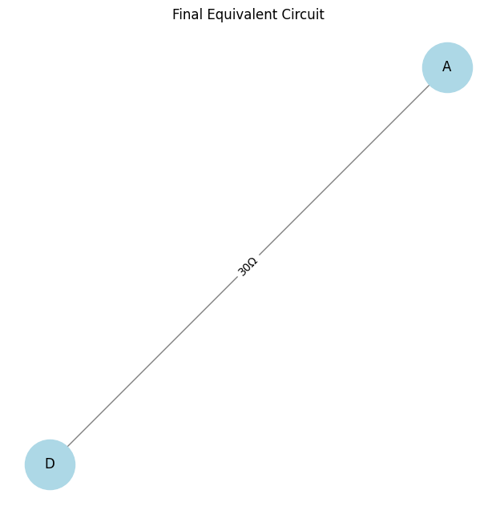

# Problem 1
### **Mathematical Formulation for Equivalent Resistance Using Graph Theory**  

The equivalent resistance \( R_{eq} \) of a circuit can be determined using the following mathematical principles:

---

### **1. Series Combination**  
For two resistors in **series**, the total resistance is simply the sum of the individual resistances:

\[
R_{\text{eq}} = R_1 + R_2 + R_3 + \dots + R_n
\]

**Condition:** The same current flows through all resistors.

---

### **2. Parallel Combination**  
For two or more resistors in **parallel**, the total resistance is given by the reciprocal formula:

\[
\frac{1}{R_{\text{eq}}} = \frac{1}{R_1} + \frac{1}{R_2} + \frac{1}{R_3} + \dots + \frac{1}{R_n}
\]

or in a compact form:

\[
R_{\text{eq}} = \left( \sum_{i=1}^{n} \frac{1}{R_i} \right)^{-1}
\]

**Condition:** The voltage across all resistors is the same.

---

### **3. Graph-Based Formulation**  
Given a circuit represented as a **graph** \( G = (V, E) \), where:  
- \( V \) is the set of nodes (junctions).  
- \( E \) is the set of edges (resistors with weights representing resistance values).  

We can define:  
- **Adjacency Matrix** \( A \), where \( A_{ij} \) stores resistance values between nodes.  
- **Conductance Matrix** \( G = A^{-1} \) (for parallel resistors, conductance is additive).  

The **effective resistance** between two nodes \( i \) and \( j \) is computed using **Kirchhoff’s Laws** and **Laplacian Matrix** \( L \):

\[
R_{eq} = (L^+)_{ii} + (L^+)_{jj} - 2(L^+)_{ij}
\]

where \( L^+ \) is the **Moore-Penrose Pseudoinverse** of the **Laplacian Matrix** \( L \).

This method is useful for complex circuits with multiple loops and connections.

---

### **Example Calculations**  
#### **Example 1: Simple Series Circuit**
Given \( R_1 = 5Ω \) and \( R_2 = 10Ω \), the equivalent resistance is:

\[
R_{\text{eq}} = 5Ω + 10Ω = 15Ω
\]

#### **Example 2: Simple Parallel Circuit**
Given \( R_1 = 6Ω \) and \( R_2 = 3Ω \):

\[
R_{\text{eq}} = \left(\frac{1}{6} + \frac{1}{3}\right)^{-1} = \left(\frac{1}{6} + \frac{2}{6}\right)^{-1} = \left(\frac{3}{6}\right)^{-1} = 2Ω
\]

**Circuit Graph Tool**  

*Visualizes & calculates resistance in circuits:*  

1. **How It Works**  
   - **Nodes** = Connection points  
   - **Edges** = Resistors (shows Ω value)  

2. **Key Features**  
   - `add_resistor()` → Build circuit  
   - `visualize()` → Show circuit diagram  
   - `equivalent_resistance()` → Calculate total R  

3. **Auto-Simplifies**  
   - Merges series resistors (R₁ + R₂)  
   - Combines parallel resistors (1/(1/R₁ + 1/R₂))  

4. **Test Examples**  
   - Series: 10Ω + 20Ω → 30Ω  
   - Parallel: 10Ω∥20Ω → 6.67Ω  
   - Bridge circuit → 1Ω  

# Problem 1.2
Here are the **mathematical formulas** for calculating equivalent resistance:  

### **1. Series Resistance**  
For resistors connected in series, the equivalent resistance is the sum of all resistances:  

\[
R_{\text{eq}} = R_1 + R_2 + R_3 + \dots + R_n
\]

### **2. Parallel Resistance**  
For resistors connected in parallel, the reciprocal of the equivalent resistance is the sum of the reciprocals of each resistance:  

\[
\frac{1}{R_{\text{eq}}} = \frac{1}{R_1} + \frac{1}{R_2} + \frac{1}{R_3} + \dots + \frac{1}{R_n}
\]

For two resistors in parallel:  

\[
R_{\text{eq}} = \frac{R_1 R_2}{R_1 + R_2}
\]

### **3. Combination of Series and Parallel Circuits**  
If a circuit consists of both series and parallel resistances, apply the formulas iteratively:  
1. **Simplify parallel resistances** first using:  

   \[
   R_{\text{parallel}} = \frac{R_1 R_2}{R_1 + R_2}
   \]

2. **Then, add series resistances** using:  

   \[
   R_{\text{eq}} = R_{\text{series}} + R_{\text{parallel}}
   \]

These formulas allow step-by-step reduction of any complex circuit using **graph theory or iterative simplification**. 🚀

### **Explanation of the Graph**  

The graph represents the **final equivalent circuit** after simplifying a complex resistor network.  

- **Nodes (A and D)**: These represent electrical junctions or terminals in the circuit.  
- **Edge (30Ω)**: The line between **A** and **D** represents a resistor with a resistance value of **30 ohms (Ω)**.  
- **Graph Simplification**: The original circuit likely had multiple resistors connected in **series and parallel**. Through **graph-based circuit analysis**, they were reduced to a single equivalent resistance of **30Ω** between nodes A and D.  
- **Visualization**: The large circles at nodes A and D highlight the key connection points in the final simplified circuit.  
