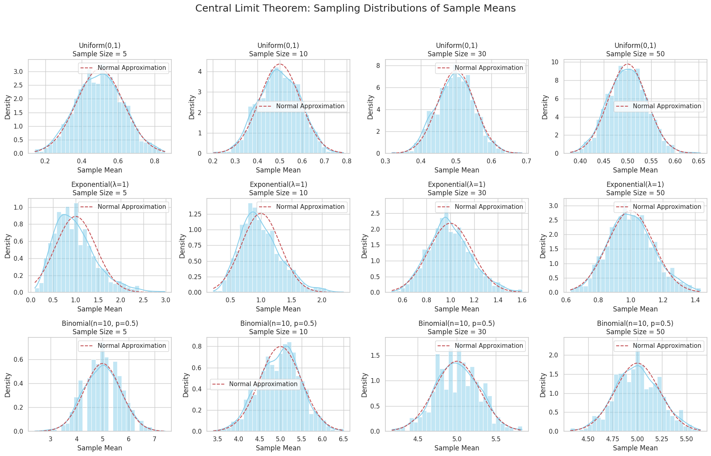

# Problem 1

Certainly! Below are the **key formulas** related to the **Central Limit Theorem (CLT)** in **clear English** with mathematical expressions. These are foundational for your report or simulation.

---

## 📘 **Key Formulas for Central Limit Theorem**

---

### **1. Sample Mean**

The sample mean $\bar{x}$ of a sample of size $n$ is:

$$
\bar{x} = \frac{1}{n} \sum_{i=1}^{n} x_i
$$

* $x_i$: the individual data points
* $n$: the number of samples
* $\bar{x}$: the average (mean) of the sample

---

### **2. Population Mean and Standard Deviation**

* Population mean:

$$
\mu = \mathbb{E}[X]
$$

* Population standard deviation:

$$
\sigma = \sqrt{\mathbb{E}[(X - \mu)^2]}
$$

Where $\mathbb{E}$ represents the expected value.

---

### **3. Standard Error of the Mean (SEM)**

As the sample size increases, the standard deviation of the sample mean (called the **standard error**) decreases:

$$
\text{SEM} = \frac{\sigma}{\sqrt{n}}
$$

* $\sigma$: population standard deviation
* $n$: sample size

---

### **4. Central Limit Theorem Statement**

Let $x_1, x_2, ..., x_n$ be i.i.d. random variables from any distribution with mean $\mu$ and variance $\sigma^2$. Then the sampling distribution of the sample mean $\bar{x}$ converges in distribution to a normal distribution as $n \to \infty$:

$$
\bar{x} \xrightarrow{d} \mathcal{N}(\mu, \frac{\sigma^2}{n})
$$

This means:

* The **sampling distribution** of the mean becomes **approximately normal**
* Even if the **original data is not normal**
* Provided that the **sample size $n$ is large enough**

Generate populations: Creates large datasets from three different distributions — Uniform, Exponential, and Binomial.

Take samples: For each distribution, repeatedly takes many samples of different sizes (5, 10, 30, 50).

Calculate sample means: Computes the mean of each sample to build the sampling distribution of the sample mean.

Plot histograms: Shows histograms of the sample means for each sample size and distribution.

Overlay normal curve: Plots the theoretical normal distribution based on the population mean and standard error on top of the histogram.
