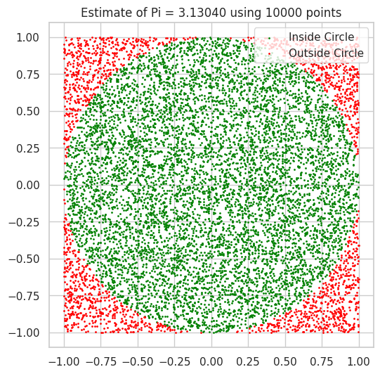
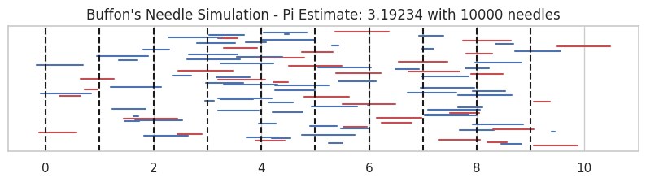

# Problem 2
Here are the key formulas (formulas) for **Estimating Pi using Monte Carlo Methods**:

---

### Part 1: Estimating π Using a Circle

* Area of unit circle:

  $$
  A_{\text{circle}} = \pi \times 1^2 = \pi
  $$

* Area of bounding square (side length 2):

  $$
  A_{\text{square}} = 2 \times 2 = 4
  $$

* Probability a random point falls inside the circle:

  $$
  P = \frac{A_{\text{circle}}}{A_{\text{square}}} = \frac{\pi}{4}
  $$

* Estimation of π based on points inside circle:

  $$
  \boxed{
  \pi \approx 4 \times \frac{\text{Number of points inside circle}}{\text{Total number of points}}
  }
  $$

---

### Part 2: Estimating π Using Buffon’s Needle

* Needle length $L$, distance between parallel lines $D$, with $L \leq D$.

* Probability needle crosses a line:

  $$
  P = \frac{2L}{\pi D}
  $$

* Estimation of π based on needle drops and crosses:

  $$
  \boxed{
  \pi \approx \frac{2L \times \text{Number of drops}}{D \times \text{Number of crosses}}
  }
  $$

---

Sure! Here’s a short explanation for the graphs in English:

---

### Circle Method Plot:

* Points inside the circle are shown in green; points outside are red.
* The ratio of green points to total points estimates $\pi/4$.
* More points make the estimate more accurate as green points fill the circle area.

### Buffon’s Needle Plot:

* Needles crossing vertical lines are blue; others are red.
* The proportion of crossing needles estimates $\pi$.
* More needles improve the accuracy of the estimate.

